> 苏生不惑第167 篇原创文章，将本公众号设为`星标`，第一时间看最新文章。

关于备份之前写过以下文章：  

[再谈备份微博](https://mp.weixin.qq.com/s?__biz=MzIyMjg2ODExMA==&mid=2247485646&idx=1&sn=792ee0555320c965df004ccf6dfb7d2a&scene=21#wechat_redirect)

[一键备份微博并导出生成PDF，顺便用Python分析微博账号数据](https://mp.weixin.qq.com/s?__biz=MzIyMjg2ODExMA==&mid=2247485035&idx=1&sn=2cda78ee89f39317decaca51c128e150&scene=21#wechat_redirect)

[再谈备份网页和公众号文章](https://mp.weixin.qq.com/s?__biz=MzIyMjg2ODExMA==&mid=2247485394&idx=1&sn=dc4908395fd184fb6aa46808d1da4469&scene=21#wechat_redirect)

[如何备份可能被删的公众号文章和网页](https://mp.weixin.qq.com/s?__biz=MzIyMjg2ODExMA==&mid=2247484424&idx=1&sn=172ca34202fe0c985f693fd621ae3eeb&scene=21#wechat_redirect)

[想看的公众号文章被删了怎么办？](https://mp.weixin.qq.com/s?__biz=MzIyMjg2ODExMA==&mid=2247484106&idx=1&sn=77ec3fed1fd6fd5197cf57f45cf831b3&scene=21#wechat_redirect)

上面写的备份公众号方法都是单篇备份，如果你想备份某个公众号的所有文章，就有点太麻烦了，所以今天分享的是用Python一键备份某个公众号的所有文章，再也不用担心想看的文章被删了，这里就以我自己的`公众号苏生不惑`为例了，原理就是通过抓包抓取微信客户端的接口，用Python请求微信接口获取公众号文章链接再下载。

### charles 抓包

常见的抓包工具有Fiddler，charles，这里用的charles，先去官网 https://www.charlesproxy.com/download 下载软件,然后打开微信客户端找到公众号，进入文章列表可以看到发过的文章。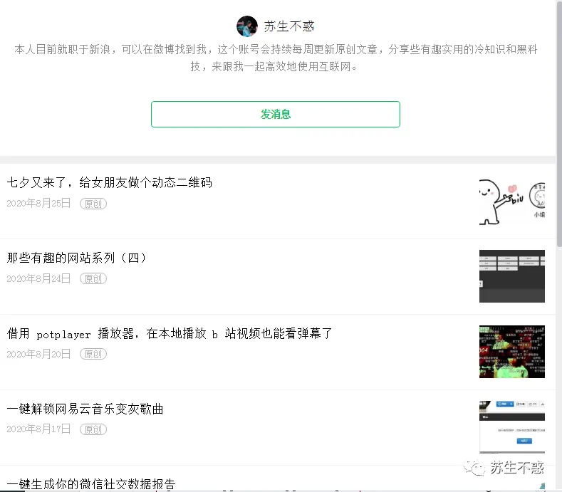

不过charles没安装证书前获取不到https接口数据，显示unknown。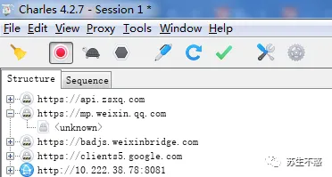安装证书后在 proxy->ssl proxying settings 添加域名和host 。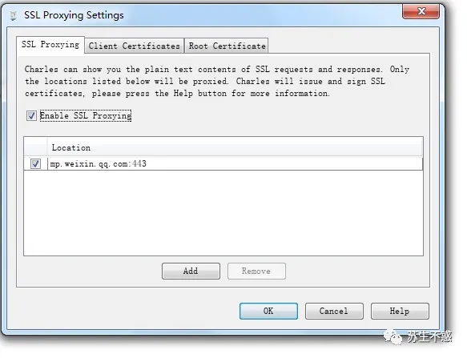再次抓取可以看到公众号文章接口数据了。

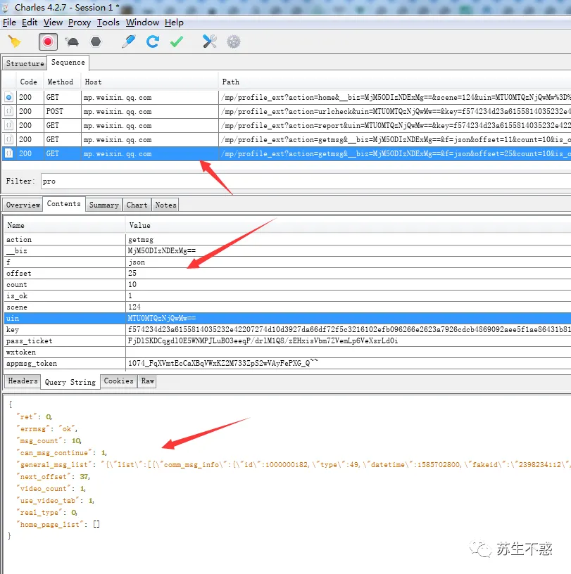公众号文章的接口地址 /mp/profile\_ext?action=getmsg&\_\_biz=MjM5ODIzNDEx&f=json&offset=25&count=10&is\_ok=1&scene=124&uin=MTU0MTQzNj&key=f57423 ，参数比较多，其中有用的参数 \_\_biz 是用户和公众号之间的唯一id，uin是用户的id，这个是不变的，key 是请求的秘钥，一段时间就会失效，offset 是偏移量，count 是每次请求的条数，返回值可以看到返回数据包括文章标题titile、摘要digest、文章地址content\_url、阅读原文地址source\_url、封面cover、作者author ，只要抓取这些有用的数据就行了。

### python 抓取公众号文章

上面分析了接口参数和返回数据，开始用Python请求微信接口就是了。

这里只抓取原创文章，我的公众号有160多篇原创，生成HTML文件2分钟就搞定了。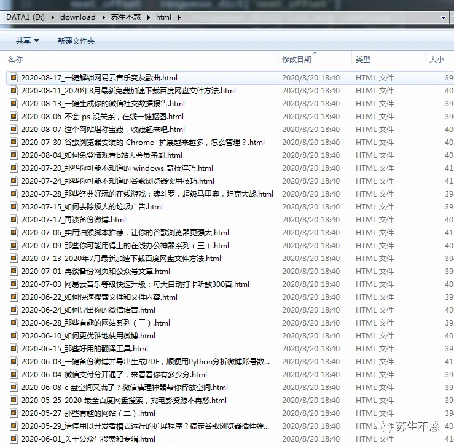用谷歌浏览器打开就能看。

生成的HTML文件还可以转成chm格式，需要先安装软件 Easy CHM，这是一款强大的CHM电子书或CHM帮助文件的快速制作工具 http://www.etextwizard.com/cn/easychm.html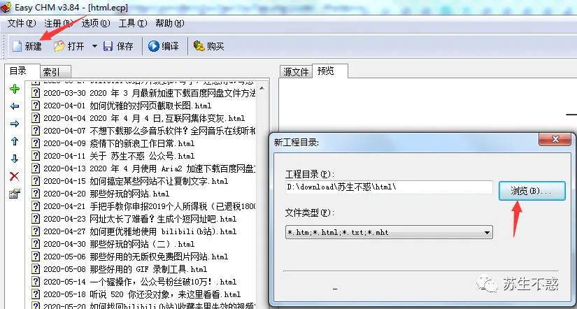左侧是文章标题，右侧是文章内容，看起来非常方便。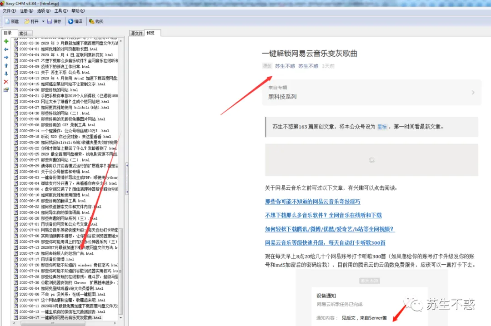

还有含有文章标题和链接的 markdown  文件，关于markdown之前文章介绍过 [用 Markdown 来写简历和 PPT](https://mp.weixin.qq.com/s?__biz=MzIyMjg2ODExMA==&mid=2247484286&idx=1&sn=c13e717dd5a2e0a8949600bc2ae1dd1a&scene=21#wechat_redirect)。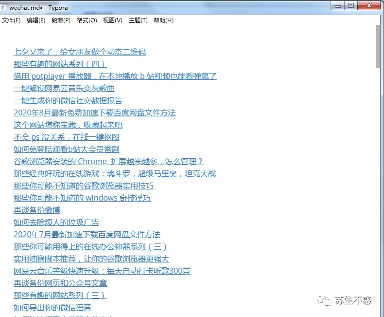excel文件格式也有。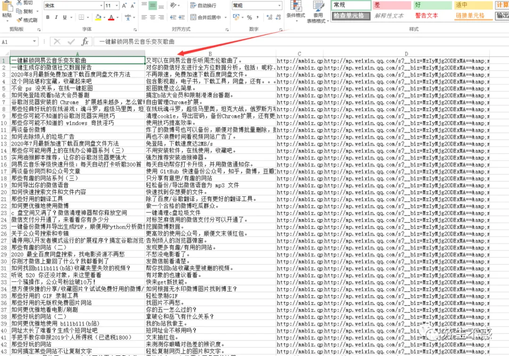

生成HTML，markdown和Excel都比较快，因为都是文本，下面开始导出PDF。

### 导出PDF

导出PDF用的工具是wkhtmltopdf  ，先到官网https://wkhtmltopdf.org/downloads.html  下载安装 wkhtmltopdf ， 安装后设置环境变量，这个之前文章写过 [那些你可能不知道的 windows 奇技淫巧](https://mp.weixin.qq.com/s?__biz=MzIyMjg2ODExMA==&mid=2247485715&idx=1&sn=33576292f746d66b0eef478586348846&scene=21#wechat_redirect)，然后直接命令行就能生成PDF。

```
<span>λ wkhtmltopdf http://www.baidu.com baidu.pdf</span>
```

比如生成百度首页的PDF。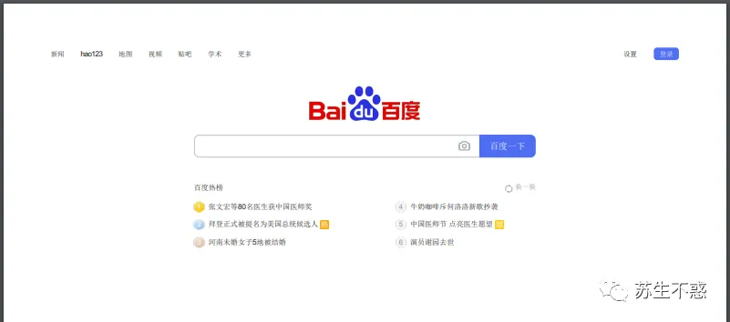Python中使用pdfkit 模块来调用wkhtmltopdf ，先用`pip install pdfkit -i http://pypi.douban.com/simple --trusted-host pypi.douban.com`来安装它。

再次运行程序，PDF文件也生成了。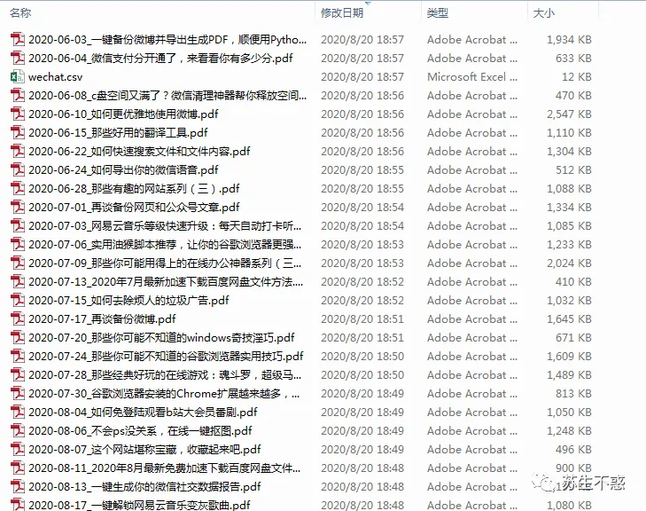PDF也可以用谷歌浏览器直接打开，比如这篇[一键解锁网易云音乐变灰歌曲](https://mp.weixin.qq.com/s?__biz=MzIyMjg2ODExMA==&mid=2247486164&idx=1&sn=c8fb97c321d01258f23c205c2098966b&scene=21#wechat_redirect)。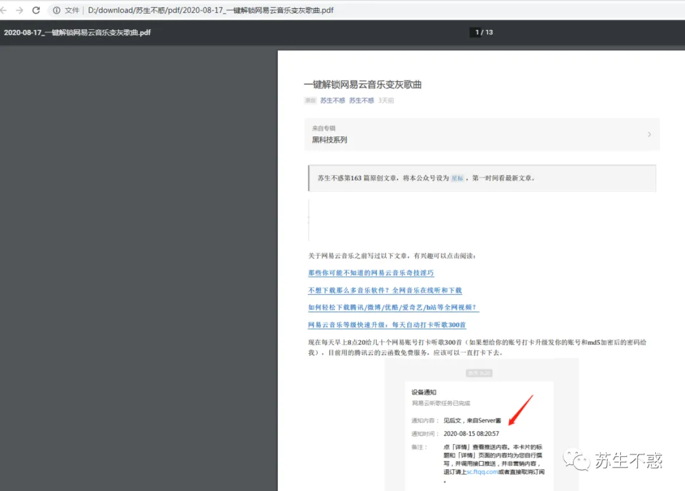

不过由于生成PDF比较慢，文章多的话key参数会失效，需要重新获取，然后修改next继续抓取。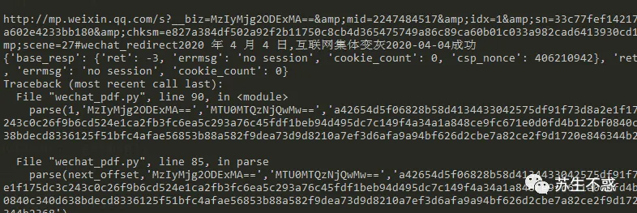

这样就完美的把我公众号的所有文章下载到本地了，有HTML，PDF，Excel，markdown，chm 格式（在公众号后台回复 `公众号` 获取我的所有原创文章，如果你有想下载的公众号可以加我微信付费帮忙下载）。

目前有个问题是如果公众号有付费文章，下载的也只能看一部分内容。

还有文章的评论也是有接口获取的，可以批量下载到excel。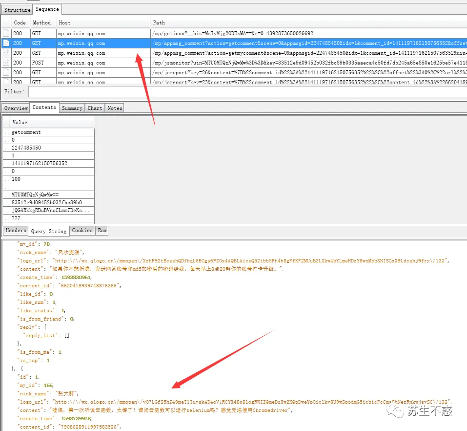

> 大家的点赞和在看转发对我非常重要，如果文章对你有帮助还请支持下， 感谢各位！

| 公众号后台回复关键词 | 用途 |
| --- | --- |
| 微信 | 获取你的微信好友头像拼图及查看微信撤回消息 |
| b站 | 获取下载b站视频工具及找回被删b站视频方法 |
| 视频 | 获取下载腾讯，优酷，爱奇艺，微博视频工具及去除logo脚本 |
| 百度网盘 | 获取加速下载网盘文件方法及查找电影电视剧网站 |
| 朋友圈 | 获取发空白朋友圈方法 |
| 微博 | 获取备份微博工具及分析微博账号数据 |
| 音乐 | 获取下载音乐工具及在线听歌网站 |
| 油猴 | 获取油猴脚本 |
| 谷歌 | 获取安装Chrome扩展方法 |
| 公众号 | 一键下载公众号所有文章 |


免费知识星球，每天更新

### 公众号 苏生不惑


扫描二维码关注或搜索微信susheng\_buhuo
