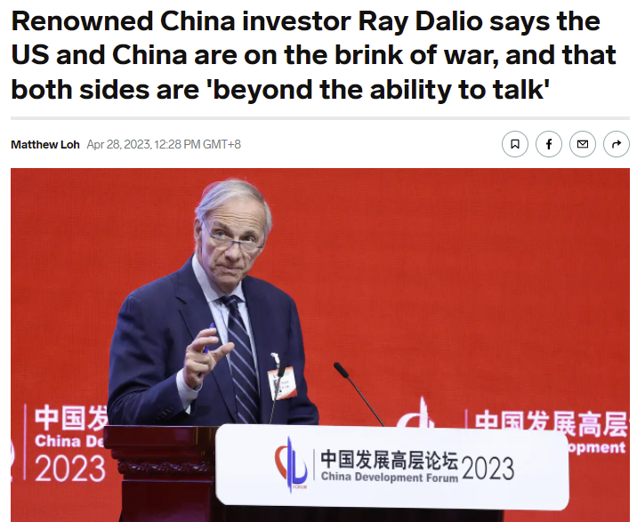
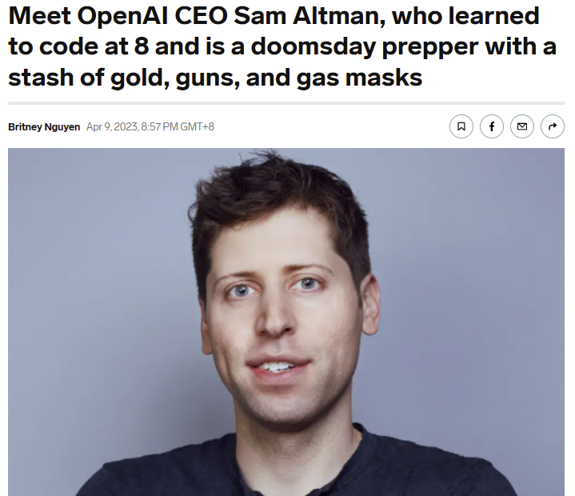

**我的战争预案**

by Bayfamily

  

中美最终会不会走入战争我们不知道，但是只能感觉这个风险越来越高，20年前如果有人提这样的话题，大家觉得他是疯子，像天方夜谭一样。今天有人谈中美战争的问题，大家感觉是现在不会发生吧，但是未来有可能发生吧。

战争中，老百姓千万不要赌谁会赢，谁会输。 因为战争和冲突和结局，和自己的好恶完全没有关系。不能一厢情愿地认为某方必赢。或者某方一定可以遵守承诺和道德底线。

其实纵观第一次世界大战，第二次世界大战或者是两次的海湾战争，阿富汗战争，当时普通老百姓并没有办法及时感觉到战争的来临。因为普通生活，大家关心柴米油盐。并不知道最高层发生了什么。

但是战争突然来临，或者战争突然结束的时候，普通老百姓受到的冲击往往是最大的，因为他们事先没有任何准备。

所以我想自己也做一些战争准备吧。胡乱列一下。我把未来可能的战争冲突定为三级，准备工作分为三级。

**第一级，中美进入新冷战。概率80%。**

这可能是中美对抗的最有可能的一种方式，就像当年的冷战一样，两个国家在世界各个地方作对厮杀，但是是代理人和代理国家之间的冲突和对抗。

这个时候就要为两个国家经济部分脱钩做准备。对于中国而言，和西方世界经济部分脱钩，可能会让中国的发展陷入停顿，人民生活和收入止步不前，房地产价格下跌，股市价格低迷。民营资本和海外资本逃逸。

对于美国而言，可能就是持续高涨的通货膨胀。或者是美元霸权本身受到挑衅。人民生活实际水平下降，因为所有的商品价格都在上涨，美元变得相对不值钱。

  

**第二级。中美在台海的直接热战。概率20%**

这有点像乌克兰模式，就是美国打一场代理人的战争，中国直接参加战争。中国被全面经济制裁。制裁方式和制裁的程度和俄罗斯一样。飞机停飞，航线封锁，金融封锁。中国和世界全面脱钩，一夜回到50年代。

因为美国有一万个理由需要遏制中国的崛起。遏制中国最好的方式，就是把中国拖入战争的泥潭。台海之间的热战，最大的可能性是美国主动挑衅。比如在适当的时机和地点宣布承认台湾独立。请君入瓮，让中国不得不发动台海战争。

**第三个级别，全面核战争。概率1/10000.** 

这种可能性非常小，当年美苏对峙的时候，人类也没有丧失最后的理智了。美苏之间没有陷入全面的核大战，互相毁灭，甚至毁灭地球。

但是核大战可能性也是有的，大部分情况来自于各种意外。比如今天回溯冷战历史，你可以看到，当系统失灵的时候是由于某个船长或者是某一个底层的技术官员，阻止了当年的核武器的互射。

未来不排除有这样的意外的可能性。比如open AI的创始人，Sam Altman, 他就坚信人类会陷入核大战。所以他为最终的doomsday做好了准备。存储了金子，枪和防毒面具。

普通人的胡言乱语，你可以不信。这世界上最聪明的人的观点，值得你多思考几分钟。

针对这三个级别的冲突，我也做了三个级别的准备。当然这些准备考虑也不见得完全。 这里抛砖引玉，供大家参考，也欢迎大家补充。

**第一级，中美进入新冷战。应对策略：第三国寻找商机**

在新冷战模式下，对中美两国的经济都会造成严重的影响。如果两种货币争取世界的霸权。最终获益的还是生活在夹缝中的各种小国家。

比如今年第一个季度中国对欧洲和美国的贸易大幅下滑，但是对于东盟国家的贸易大幅上升。其实东盟国家哪里有那么多需求。 很多出口到美国和欧洲的产品受关税的影响，不得不转移生产到东南亚国家，或者只是到东南亚国家去洗个澡。换一个包装。

贸易逐步脱钩，旧的供应链被打破，会有新的商机。

**第二级。中美在台海热战。应对策略：保值投资，增加贷款，第三国护照。**

最好的方式还是准备一个第三国的护照，无论是欧洲的，还是美洲的或者其他什么小国家的。因为如果新冷战降临，那无论是在美国的华人还是在中国的持美国护照的人都会被迫害。被排斥。

最好的方式还是另寻净土。至少可以做到行动上的自由。目前来看是中国的大量富有人群转去新加坡。未来可能会出现美国的华人转去持有其他第三国的护照。

我自己的倾向是持有一个和中国并不建交的国家的护照。比如加勒比海的某些小国。

如果发生台海冲突，那对于我们而言最好的方法就是保住自己的资产。资产最好放到保值的地方去，比如黄金和比特币，或者蓝筹美股。

中国的体量和俄罗斯不可同日而语。如果发生热战，受到重创的不单是中国，也包括美国，包括所有的美元现金资产。

回顾乌克兰战争爆发的时候，当时最好的投资方式是不要持有卢布现金。而是在莫斯科大量的购买房产，尤其是用大额贷款购买房产。

因为战争已爆发之后，这些贷款随着卢布的贬值迅速变得消失与无形。而另外一方面由于卢布贬值，大家都把手上的现金换到可以保值的资产中。导致莫斯科的房价暴涨。所以这时候，两头挣钱。

换句话说，台海战争爆发前，你应该拉高杠杆去买北京上海的房子。

另外一方面，由于中国体量巨大，金融制裁，对美元霸权会产生非常大的冲击。这个时候最好的避险方式就是持有黄金和比特币。尤其是后者，如果中美爆发冲突会导致一系列的金融制裁与反制裁。在那个时候，美元和人民币的流动性都会受到很大的冲击。

其实应对通货膨胀最好的方式是拥有某一种持续挣钱的能力，拥有某一个business。当你能够持续为社会提供服务的时候，你就有涨价的权利。随着通货膨胀，你的收入就会越来越多。比如你拥有一个理发店，你可以持续挣钱。

通货膨胀高涨的时候，最惨的人就是退休或者是拿固定收入的人。

所以当台海发生冲突的时候，最好的办法还是持有保值资产。如果判断本币要贬值，无论是在中国还是美国就是搞各种贷款。各种形式的贷款，无论是房屋抵押贷款，还是用贷款的方式购买business。

**第三个级别。核大战。应当策略：广积粮。**

虽然核大战可能性很低很低，但是如果做一些准备，用极低的成本做一些准备，恐怕也是值得的。特别是进入第二级热战之后，需要准备起来了。 如果发生全面核大战，你逃到哪个国家都是没有用的。进入核冬天，全球降温5-10度。没有吃的，大家都要完蛋。

这个时候最关键的就是准备食物，尤其是长期保存的食物。100枚核弹引发的核冬天持续的时间会长达五年。庄稼颗粒无收，社会秩序会一片混乱。全世界全面恢复秩序，可能需要30年到50年。更大规模，上千枚规模的核战争。后果不怕想象。可能90%的人会死去。

长期有效，没有电的情况下可以保存的食物就两种，一种是干豆子，另外一种是蜂蜜。这两种食物可以保存30年以上。其他的比如大米面粉，各种罐头都很难保存10年以上的时间。

所以你要做的事情非常简单，根据自己的热量摄入，计算20年的量。去买足够多的干豆子和蜂蜜，把它们放在一个大铁桶里，然后要么埋在地里，要么藏在屋子的阁楼上。当然这是基础的热量食物，你还会种菜，钓鱼，狩猎换换胃口。

当然Domesday发生的时候，你准备再多的食物被别人抢走也是没有用的。所以你需要准备足够多的枪械用来自卫，还有你需要到一个人少的地方去。

如果你在大陆或者是在大城市的周围，那生存下来的概率非常低。提高自己的生存概率，最好是有access to ocean。坐船出逃到没人的海岛。或者提前在海岛做好准备。

**总结一下，**

我感觉中美之间陷入战争的可能性，随着时间的推移变得越来越大。目前渐渐进入第一个级别，未来最大的可能是在第一到第二级别之间的冲突。

虽然杞人忧天不值得。无论哪种形式，普通老百姓最好为自己做一些打算。准备一下预案。不一定采取行动，但是心理上有所准备。

每次战争冲突，必然有老百姓倒霉。这次不知道又是谁。

历史上，无数老百姓因为没有这些预案，导致自己陷入悲惨的境地。比如二次世界大战时候的日裔美国人；比如苏德战争爆发之前东欧的犹太人；比如第一次海湾战争的库尔德人人；比如第二次海湾战争后的叙利亚人；比如美国突然撤军之后的阿富汗人。再比如辽沈战役的长春人；越战结束前夜的越南华人。
