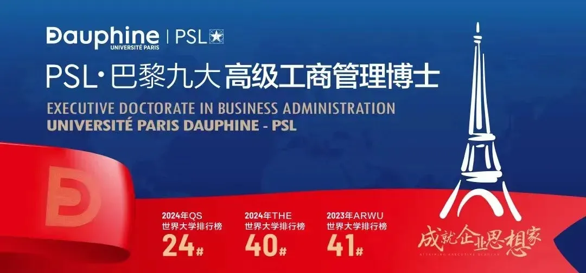
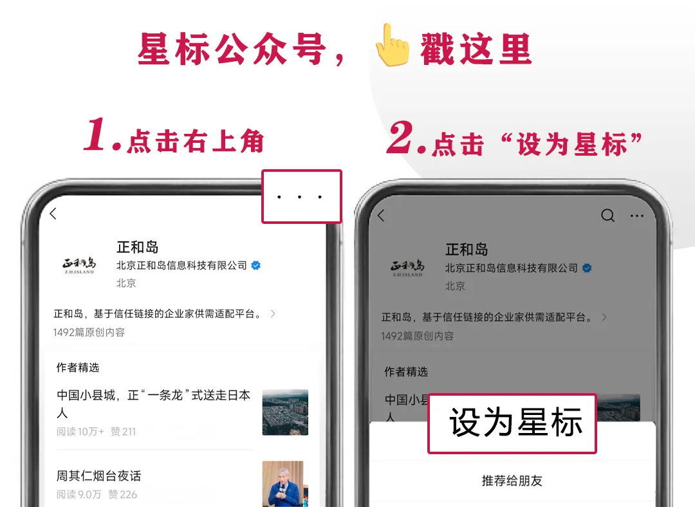
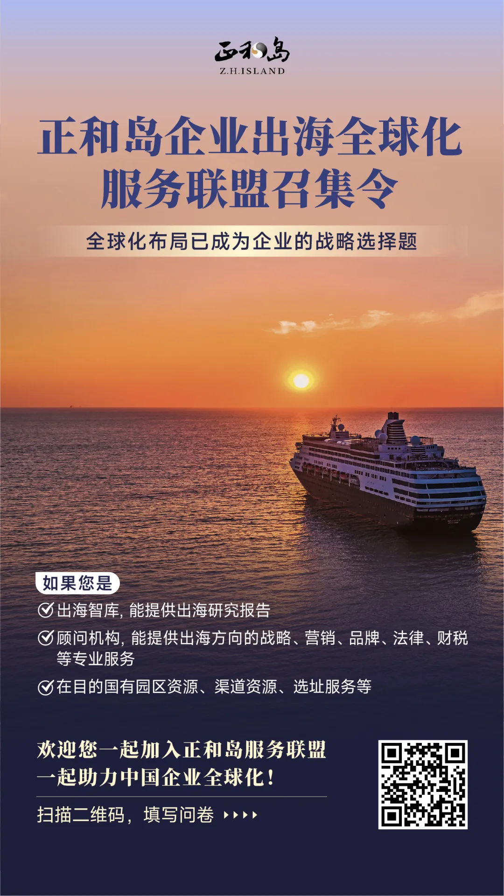

今天我们像是陷入在了一个怪圈里面。

与历史相比，我们身处百年未有之大变局，社会每一天都在发生新的改变，但是我们身边的人获得感越来越少，参与度越来越低。

技术在不断地进步与创新，我们却很难感受到真正的幸福，更多是沉湎在本能的、靠多巴胺刺激的短暂快乐中。

物质条件越来越充裕，我们却活得越来越空虚。

每一天、每一月、每一年我们更多像是在重复、循环，甚至上一代人与下一代人的生活也陷入了这种无休止的循环当中。

……

这是一个时代大多数人的心声，也是我们当下所面临的现实困境与精神困境。因此，针对这些问题，近日我们采访了计算机科学家、《脉络》的作者吴军老师。

以下为采访内容精编，希望他的一些思考对你有所启发：

口 述：吴军 计算机科学家、《脉络》作者

采 编：微澜

来 源：正和岛（ID：zhenghedao）

**大势：除文明，别无他物**

**问：**过去，谈到历史史观，总会有人对英雄史观和人民史观争论不休。您在书中提到历史上除了“文明”二字，别无他物——其他的事情都是表象，难以预测，也不需要预测。为什么这么说？

**吴军：**如果你接受了文明史观，你就会用一种新的视角去判断人和事，即**但凡对文明进步有益的事情，哪怕小，也是有意义的；但凡对文明有贡献的人，都是值得尊敬的。**

但今天认同英雄史观或人民史观的人依旧占大多数。

前者是大多数人会总觉得，自己想做点大事，但是觉得自己身份低微，没有资源，做不到，一心想要往上爬，获得资源，以为有了权力就能施展抱负。

后者中的大部分则反过来，认为自己做了一点点事情，就觉得该获得整个社会的肯定，获得比自己的贡献更多的报酬，甚至觉得自己不做事情，社会也该照顾他。这些人想法的依据，就是所谓的历史由大众创造，他们既然是大众的一员，就为创造历史有所奉献。

但其实他们忽略一点，无论是历史还是现在，大多数人在创造的同时也在消耗地球的资源和社会的资源，创造的与消耗的相抵消，这里也包括在历史上的一些皇帝，尽管他们位高权重，符合英雄史观的角度，但他们创造的与消耗相比甚至是负数。

**从这个角度看，他们其实是文明的破坏者，而不是创造者。**

事实上，今天人类文明也同样站在历史的十字路口上，而这将决定文明是继续快速发展，还是大家一起回到文明停滞、无尽循环的老路上。

回顾历史，**前一种情况不多见，长期循环没有进步反而是常态。**

哪怕在今天世界上大部分地区也是在不断循环，没有进步的。正如马尔克斯笔下的《百年孤独》就反映出了这种循环的困境：

**我们用什么态度看待历史，决定了我们用什么态度看待今天的社会。**

**问：**有句老话叫做，人类从历史中吸取的唯一教训就是人类从不吸取教训。那么我们还需要思考用什么态度看待历史吗？

**吴军：**我们可以先分析一下，为什么人类如此难以吸取教训？有三个主要原因：

**第一，历史的很多规律很难总结，即使总结出一些所谓的规律，在后来条件稍微有所改变后，也变得没有太多的参考意义了。**

拿统计学来说，即使统计一下某件事发生或不发生的概率，也需要几百个样本才能得到具有95%以上置信度的结论。但绝大部分历史事件不可能出现那么多次，甚至很多只出现一次，而这样得到的所谓规律其实更多是巧合。

**第二，人的一些天生的弱点让人即使知道什么是对的，也不会去做。**

比如在欧美的很多高福利政策，已经催生了很多“懒人”，甚至导致国家的财政支出过高，但是这些高福利政策没有被阻止，反而更加激进、变本加厉，为什么呢？

因为政客需要选票，同时民众希望明天就获得更多的福利。获得选票和福利最简单的方法就是一方承诺更多的福利，另一方选举能提供更多福利的代表上台，至于长远的经济发展，其实很少有人管。

**第三，很多人对于历史的结果找错了原因。换句话说，用错误的规律指导自己，自然会南辕北辙。**

拿中国古代来说，中国发生了多次因授予皇室子弟藩王实权而导致得地方叛乱甚至政权更迭，比如西汉的“七国之乱”、西晋的“八王之乱”，以及明朝朱棣推翻自己侄子的统治，自己当皇帝。

**究其原因，几乎每一次都和当权者错误吸取前朝灭亡教训有关。**但今天我们回过头来看，每个王朝灭亡的原因有很多，不是简单把权力交给自己的皇室子弟或者制约皇室子弟那么简单。

事实上，给看到的现象找一个逻辑上能够自洽的解释是一件很容易的事，但是找到真正原因和结果之间的逻辑关系，是很难的。对于受到诸多因素影响的历史问题，总结规律就更难了。

也因此，**今天绝大部分做出成果的人，更倾向于用当下得到的学习，而不是历史上发生的事情来指导行动，毕竟今天不可能完全重复历史。**

**问：**您在书中阐述了一个观点，过往的历史其实只有一件事，就是近代化，如何理解？在近代后，回顾全球的发展变化，能不能也用一件事或者几件事来概括？

**吴军：**为什么这么说？我打个比方大家就明白了。

从前在非洲的丛林里有一群猴子，一只猴王取代了另一只猴王统治着那里，虽然每一次新猴王取代老猴王都让猴子们惊讶不已，但那不能称为历史。后来有一天，几只猴子从树上下来，开始使用火种和工具，然后从非洲大陆走向世界，那才是真正的历史的进步。

农业革命是这样，而工业革命以及因此而产生的近代化也是如此。并且由工业革命带来的近代化与农业革命相比，带来的是在能量的使用和信息产生、传递方面的巨大飞跃。

**事实上，从人类进入文明社会以来，能量和信息就是衡量世界文明程度的硬性标准——两个文明的竞争，比的就是哪个文明更擅长使用能量和信息**。

至于近代化以后，我认为发生在全世界范围内影响最大的事情，就是中国的改革开放。这比第一次世界大战、第二次世界大战，甚至是苏联解体等影响都要大。

为什么这么说？

**因为改革开放让世界上五分之一的人口从人均GDP100多美元达到1万多美元，历史上从来没有发生过这么大的变化。**

并且，改革开放之后，中华民族被压抑了上千年的人性和创造力得到了释放。

事实上，如果你再去回顾改革开放中什么政策发挥了关键性作用，很难说清楚。但是所有人都知道一件事，**你有本事、有头脑、有能力，你就能够致富，能够成功。**

可以说，这件事在中国过去的历史上，没有任何一个时代比改革开放让人的创造性实现了最大的发挥。

并且，作为一个占据世界人口五分之一的国家，**中国的改革开放不仅深切地改变了中国，也深刻地影响了世界，对促进全球化进程发挥了重要作用。**

这里还值得一提的是，今天很多人爱说这样一句话，**19世纪是英国的时代，20世纪是美国的时代，21世纪是中国的时代。**

这句话有一定的道理，但不是特别准确。

如果我们把它稍微修改一下，就会准确许多——从第一次工业革命（18世纪末）到20世纪初，英国人做对了事情；从19世纪到20世纪末，美国人做对了事情；从1978年至今，中国人做对了事情。

**任何一个国家如果做对了事情，它就是那个时代的代表。那么从工业革命之后，英国人、美国人和中国人各做对了什么事情呢？**

答案就是所倡导的事情，也就是**让每一个民众靠自身的努力富裕起来，获得财富，然后通过拥有财富获得自由。**在这个过程中，会有人比其他人更富裕，但是社会并不因此剥夺富人的财富，反而将他们树立为样板，让其他人看到自己将来也能成为这样的人。

过去的美国是这样，改革开放后的中国也是这样。

这就是我为什么说中国绝大部分人都认可保守主义的思想。在经过了2000多年不停地改朝换代之后，今天的中国人更愿意接受和风细雨般的改良，在经济上更愿意通过自己的努力改变经济地位，而不是一切依赖于社会。

与中国不同的是，21世纪的美国已经背离了这种做法。**如果中国还能坚持下去做对事情，那么几十年下来，从结果上讲，未来的时代就是中国的时代。**

**小我：普通人如何成功？**

**问：**在您看来，于大多数人来说，未来5-10年，目前社会发展面临的几大变量是什么？

**吴军：****首先，我认为未来5-10年，最大的变量，是全球化面临重新的洗牌。**

因为其涉及到全世界的经济与贸易布局，而这将对无数的人造成影响，并且这种影响是在不知不觉中进行的，等你真意识到了的那一天，可能已经是翻天覆地的变化了。

**第二是老龄化问题。**很多年轻人目前可能体会不到这点，但到了我这个年纪50多岁，或者40多岁，应该是能感同身受。

前一段时间，我参加一个同学聚会，我的同学们相对收入还是比较高的，每年花个几十万把父母送到好的疗养院去照看着，每个月带着去检查身体或者拿药，但这些对他们来说其实也是一个巨大的负担。用他们的话说，就是老人们生不如死，他们也生不如死。

中国目前65岁以上的老人才占人口不到15%，而日本老年人口占比已经是29.1%了，如果真到了这样一个社会，其实是非常大的负担。

**第三是气候问题。**这个是大家都看得见的，并且近一段时间全球各地出现严重的气候灾害，如迪拜大暴雨、武汉红色大雾、广州的强龙卷风，大家都应该有感知。

**第四是技术进步本身。**随着技术的发展，一方面推动社会生产力、生产方式的发展和变革，但另一方面也会带来大量的问题，并且这些问题产生的速度要远比你找到解决方案的速度要快。

举个例子，拿电动汽车来说，现在电动汽车行业发展蒸蒸日上，你可能觉得它不会给社会带来什么不好的问题，但是很多事情需要拉长时间来看。

好几年前我跟今日头条的一些人去交流，讨论头条的整合情况，在交流过程中，你就能知道随着头条的快速发展，它其实是把很多地区的传统媒体给摧毁掉了，很多过去做传统媒体的人都沦落为给头条做内容审核了，这个落差还是很大的。

同样，AI其实也有这个问题，如ChatGPT背后的信息标注依靠的就是Scale AI这家数据标注公司雇佣了大量的信息标注员，一开始这些员工在美国找，时薪20美元，后来他们发现在肯尼亚同样条件的信息标注员时薪只要2美元，这个时候你甚至想成为AI“服务员”都求而不得了。

**问：**那么，您认为对一个普通人而言，在这样一个时代，如果他想要不断追求优秀，实现持续性发展，从而不落后于时代潮流，您认为他应该具备哪些基本能力和品质？

**吴军：首先，做一个善良的人。**

中国有句老话：好人有好报。这看起来有点像迷信因果报应，但是无论是国人上千年来总结的智慧，还是我们这么多年的心得体会，做一个好人是很有必要的。

尽管个人力量有时候显得强大无比，但是人总是会遇到逆境的时候，这个时候他人的帮助就很重要了。事实上，任何的成功都离不开他人的帮助，所以记住做一个善良的人，千万不要把路走死了。

**第二，具备对形势的判断能力。**

拿股市来说，有输有赢是一件很正常的事情，但是有的股民永远只输不赢，这就有大问题了，因为你让一只猴子来炒股，它可能还是输赢各半。

什么样的人会只输不赢？当一个人相信自己能精准把握进出股市的时间时，他离只输不赢就已经不远了。

我们可以举一个简单的例子，大部分投资股票的人，在某些股票买不进去的时候，你让他预测未来，他预测的方向总是上涨的，而那些把股票卖了的人，你再让他去预测股票，他一定是预测股票会下跌的，完全做不到客观判断。

股市还有一个规律，就是股票最后（收盘）的价格，尤其是到了周五有期权到期的时候，必然要让股票的价格停在让最多人痛苦的价位上。

因此你需要有一个对形势地准确判断。很多人都只会站在对自己有利的立场上进行判断，从而选择性地甚至完全地忽略了很多事实，但实际上这种判断应当超越个人好恶，基于事实和数据做出理性判断。

**第三，培养好自己的专业能力。**

变优秀是一个抽象的词，你至少要有一件事做的比周围人好很多，你才能说优秀。

如果你做什么事情都只做到了50%的程度，你问我怎么变优秀，这种情况你没法优秀。但是，当你一件事做到了99%，而别人都是50%的时候，你也不用去问你怎么变优秀了，因为这件事上你就是优秀的。

今天有很多误导大家的概念，比如所谓的“斜杠青年”，像“万金油”一样既做这些事，又做那些活，最后什么本事都没有掌握，这其实是“伪斜杠青年”，是一个浮躁的表现。

真正的斜杠青年应需要满足3个条件，**即在自己所处的领域里精耕细作，并做出了一定的成就，并且这种成就不是你自以为的，而是被市场付费买单验证过的。**

你只有静下心来专注把一件事做好，那么无论经济形势如何变化，那些能够在某一领域做到优秀、顶尖的人总能够找到自己的立足之地。

**问：**您觉得当下随着技术的发展，它会拉大人与人的不平等，还是说会随着技术的发展走向更加的平等？

**吴军：**事实上，**在未来的社会，真正受益于技术进步的个人可能不超过人口的2%。**

并且这点是很难避免的，没有什么好的办法。因为一开始掌握技术的就是少数人，而这些人又能通过技术获得更多的财富。

总有很多人以为，技术进步能缩小人和人之间的差距。但其实自然界本身就是不平等的，哪怕人为地进行调整，过了一阵子后又会进行自然演变，即任何一群人在任何一个时代，给他们自由的发展空间，过不了两代人，就会进行阶层分化，走向不平等。

人的各阶层是呈金字塔分布的，甚至连宇宙中的资源分配也是天然呈金子塔特征的。比如整个银河系，可能其中90%的能看到的质量就只集中在1%的星体上，剩下的星体没有多少重量。

要知道，人在自然规律面前其实很渺小的。一个社会想要逆规律办事，刻意拉平所有人的差距，追求绝对的公平基本不可能实现的。

平不平等其实是天道，举个例子，你一出生下来在农村、在小城市，他一出生下来是北京人、上海人，这个不平等是没法改变的，和科技也没有必然的关系。

但必须承认一点，有了科技，至少生活在最底层的人能吃饱肚子，还能有闲暇想一些自己的问题。

比如，工业革命早期，不要说穷人基本看不到任何的未来，富人也好不到哪里去。

英国伦敦郊外有个叫巴斯的城市，是最有钱的人度假的地方。你到巴斯的博物馆，可以体会到当时英国最上层人士的生活水平，他们比你现在的生活水平差远了，没有冰箱，只有地窖里存了点腌肉。有了点茶叶还要锁起来，怕被女仆偷了。甚至没法每天洗头，只能用梳子挠痒痒。

但今天哪怕是难民到欧洲，想的第一件事可能不是肚子里有没有饭吃，而是有没有地方充电。

所以，**一方面只有少数人可以靠着更先进的科技获得更多的财富，导致贫富差距拉大；但另一方面，科技本身也提高了平等的下限，让更多人拥有机会。**

**小我与大势，终局是什么？**

**问：**社会上很多年轻人可能会流行一个观点，就是自己生不逢时，没有早几十年赶上改革开放早期浪潮，也没有晚几十年，直接享受如AI等新一波科技大爆发带来的成果，偏偏赶在了当下这个时代，需要直面老龄化加速、企业裁员、高房价等各种问题，活得是真累，想躺平又不能真躺平。

  
您如何看待这种观点？您这本书的副标题是《小我与大势》，对小我来说，如何读懂并抓住大势？

**吴军：**事实上，任何时代都有主动的人和被动的人。就像尼采曾提出来的，人们应当培养一种主人翁和独立心态来面对生活中的各种挑战。

拿AI时代来说，你如果去看哪些人受益，哪些人没受益，会发现现实和大家想象的完全不一样。

中美两个AI技术发展最快的国家中，如果要问过去裁员裁的最多的是哪些人？其实是那些互联网大厂的程序员们。

很多人觉得AI来了以后，会不会把外卖小哥们替代掉，或者说把工厂的工人给替代掉，或者是那些看起来很低端的行业给消灭？但其实AI替代掉的恰恰是那些自视甚高、自以为可以享福的这些人。

**生命总会自己找到出路。**世界上有很多药，但唯独没有治懒病的药。

**在AI时代最快被淘汰的只有三种人：**

**第一，不愿意费体力的人，**像外卖小哥、快递小哥他们靠体力挣钱的，反而不会被淘汰，无论是中国还是美国，这些行业的就业人数都在不断增加；

**第二，懒得动脑力的人，**也就是你说的想躺平的那些人。就拿AI编程来说，现在有了ChatGPT这些产品能辅助写代码，8个小时的活两小时就干完了，那对不起，你们四个人就剩一个人了，所以说你懒得动脑子，你会被AI给淘汰掉；

**第三，不从事创造性工作的人，**这点跟懒得动脑有类似的地方。就是你从事的非创造性的工作，只是靠着复制、粘贴、抄答案，那么你抄答案是抄不过ChatGPT，在很多已有标准答案的工作或事情中，ChatGPT比你快多了。

所以这三种人是最容易被淘汰的，那么有没有生不逢时的呢？

有，但不多。更多的情况应该说是相对好和相对坏，事实上，我们现在所处的当下这个生活年代，比我们父辈那一代已经好多了。

比如我们父辈那时候做科研，在那么艰难的环境、一穷二白的情况下，还肩负着让中国科技达到世界先进水平的使命，最后他们不仅生存下来了，还成功做到了。

很多时候人都容易陷入一个误区，即过分地把自己的失败归结于一个客观条件，比如说父母没门路，所以今天自己才怎么怎么都做不好；或者说因为要赚钱养家，所以我就没时间学习，没时间提升自己的专业能力了。

但这些都是自己给自己找的理由。**世界上每个人都有自己的困难，有的人想办法把困难给解决了，而有的人拿困难作为借口。**

很多时候人还是需要从自身找原因，环境的因素确实很重要，但环境因素个人很难改变，你能控制的只有你自己。

所以我觉得，只要你尽可能地比别人做得好一点，哪怕每天只比别人好1%，可能两年下来情况就大不相同了。

**问：**人的一生往往是在见识了大千世界后，才能形成对这个世界的态度和建立起自己的格局，从而实现人生的（物质和精神）富足，但富足之后呢，我们还需要回顾自己这一生的脉络和时代的脉络，在这个过程中，最终找到属于自己的使命。对大多数人来说，最终该如何找到属于自己的使命和意义？

**吴军：**其实，人这一辈子其实追求的就是一种自由。那么如何才能真正地获得这种自由？就像我之前说的，**首先你需要把自己当成这个社会的主人来看，而不是成为一个“奴隶”。**

什么是“奴隶”？我挣钱养家糊口供一套房子，最后用数十年时间把房子的钱还清了，这在一定程度上叫“奴隶”。

当下很多人脑海里首先想着的还是有房有车的生活，并认为自己的生活之所以有很多不幸也是因为缺了这两样东西。

但事实真的是这样吗？

实际上在今天的中国，除非说你遭遇一些大的变故，那不然你钱多点、钱少点其实都不影响基本的生活，**相反真正影响你的是你的精神状态。**

我记得在我20多岁读了很多启蒙思想家的书后，觉得人这一辈子得为世界文明做点什么，甭管做什么，当科学家也好，做产品也好，或者说写书传播知识和思想，你总得做点什么。

我认为人还是要有点理想的，这个并不需要很多钱，也不是说非得等我有了钱不愁吃、不愁穿后再去思考它。

**或许，今天的社会，还远不是理想的社会，但是已经给了我们很大的自由来实现自我价值。**

我曾在《见识》一书中讲过，人生是一条河，它的影响力取决于三个维度的因素：**影响的广度、深度和影响时间的长度。**

**一个人的价值也大抵如此，其价值取决于有多少人因为他的存在而受益、受益有多少，最后他的精神遗产能持续多久。**

当一个人时刻想到，他生活的每一天都要让自己的生命变得更有意义、有价值，那么他的生活就永远是充盈的。

  

**排版** | 沈望望

**编辑** | 微澜   **主编** | 孙允广

