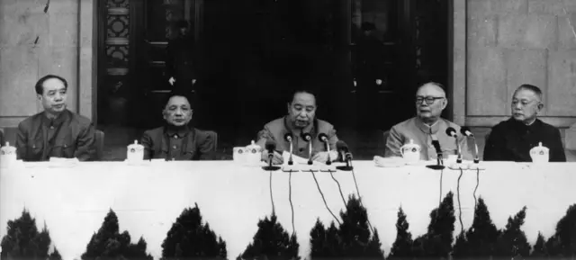
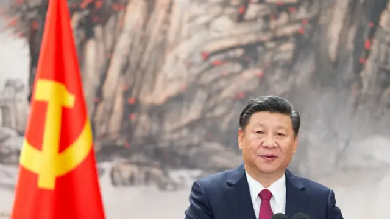
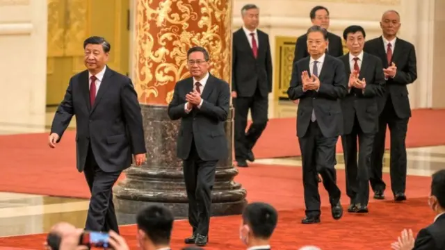
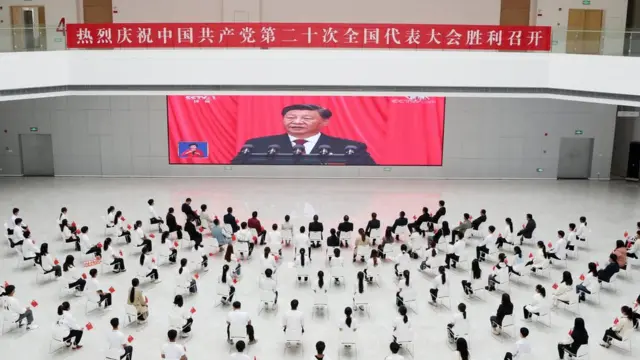
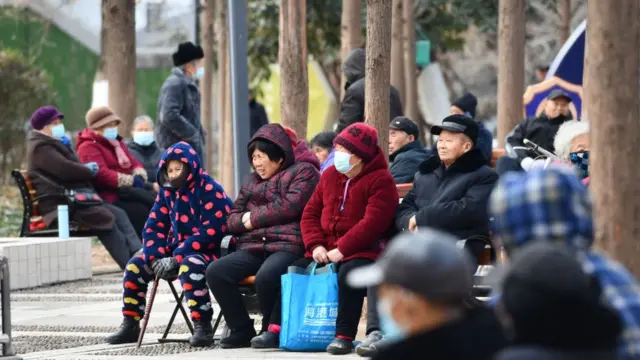
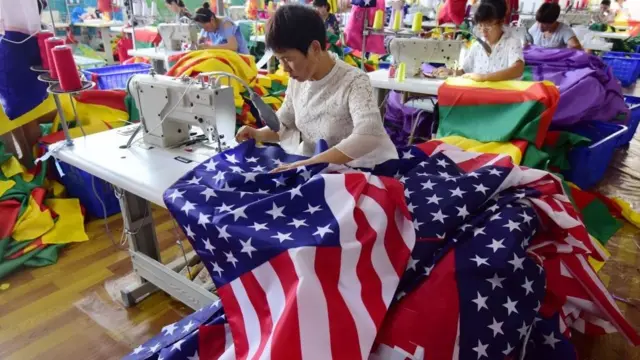

## 中共二十届三中全会前瞻：推迟原因、核心议题与深层背景

2024年6月27日

图像来源，Getty Images

**中国新华社报道确认，中共中央政治局6月27日召开会议，决定二十届三中全会7月15日至18日在北京召开。会议主题是“研究进一步全面深入改革、推进中国式现代化问题”。**

这次被视为脱离常规的全会已引起广泛关注和讨论。

一方面，按照近四十多年来的惯例，本届三中全会原本预期在党代会次年召开，即2023年秋季。此次三中全会日期比惯例晚了将近一年，国际媒体猜测中共是否内部意见不一，抑或是疫情后经济不振使改革进程不得不延后。此外，前外长秦刚和前防长李尚福落马后一直未有官方定性，本届全会是否将撤销其中央委员身份并公布更多细节，也一直是外界关注的焦点。

-   [秦刚：中国决定免去其外交部长一职，任命王毅为外长](https://www.bbc.com/zhongwen/simp/chinese-news-66276701)
-   [李尚福与秦刚双双遭罢免，对习近平意味着什么？](https://www.bbc.com/zhongwen/simp/chinese-news-67203607)
-   [中国外长秦刚“消失”引关注 “网上传言未完全遭审查不寻常”](https://www.bbc.com/zhongwen/simp/chinese-news-66231196)

另一方面，中国面临复杂而危险的外部环境，中美竞争加剧且美国大选在即，贸易摩擦、科技封堵、台海紧张，这些议题不仅限于经济，但都为中国发展前景划下问号，也使中国内外都瞩目此次三中全会能为上述挑战提供何种答案。

“三中全会”在中共历史上具有特殊意义，1978年的十一届三中全会，在中国的教科书中被描述为“开启了改革开放”，此后历届三中全会大都聚焦经济改革，往往对中国的发展起到决定性作用。

在习近平时代，各种惯例不断被打破，经济政策摇摆不定，而离上一次聚焦经济改革的三中全会已过去十年，那么7月的二十届三中全会会像1978年的那次三中全会一样突破桎梏吗？从人口、科技到财政，它会聚焦哪些改革议题？在美国大选之年，这届三中全会如何平衡中美竞争与经济发展的潜在矛盾？更重要的是，这场会议，对未来五至十年的中国提供什么的愿景？BBC中文采访不同背景的专家，进行梳理和分析。

## 三中全会：五年一次的“非常之会”

在当代中国人的记忆中，三中全会有着特殊的重要意义，因为在中共语境中，“改革开放”即肇始于1978年的十一届三中全会。

在这场会议前后一系列纷繁而剧烈的变化快速展开——

-   会前五天，邓小平发表《解放思想，实事求是，团结一致向前看》的讲话，提出“如果现在再不实行改革，我们的现代化事业和社会主义事业就会被葬送。要允许一部分地区、一部分企业、一部分工人农民，由于辛勤努力成绩大而收入先多一些，生活先好起来。这是一个大政策。”
-   1978年12月18日十一届三中全会正式召开，会议先全面否定时任中共中央主席兼国务院总理华国锋提出“两个凡是”方针，停止“以阶级斗争为纲”口号。“两个凡是”指的是“凡是毛主席作出的决策，我们都坚决维护；凡是毛主席的指示，我们都始终不渝地遵循”。
-   紧接着，大船掉头，做出决定，把工作重点转移到社会主义现代化建设上来，实行改革开放。此后，“改革开放”成为几十年快速发展的时代称谓。
-   十一届三中全会还在政治上有所突破，批评了文化大革命时期开始的对领袖个人崇拜的问题，平反了文革导致的大批冤假错案，重新评价了毛泽东的功过。

这场会议次年，松下电器、可口可乐、IBM等企业进驻中国。

自此之后，每五年一次的三中全会大部分都承载着制订出台重大经济改革政策的预期，同时也让“以经济建设为中心”在当代中国成为主旋律。

图像来源，Keystone

图像加注文字，1977年毛主席逝世一周年及毛主席纪念堂落成典礼大会上，从左到右依次就坐的中共领导人：汪东兴、邓小平、华国锋、叶剑英、李先念。一年之后的十一届三中全会，华国锋失去权力，中国进入邓小平时代。

当前的中国面临内外压力，二十届三中全会是否会像46年前的十一届三中全会一样，迎来一场突破性的改革之会？

“我们在各地调研时不止一次听到这样的声音：中国现在需要一次类似十一届三中全会的会议，要有振聋发聩的重大改革来打破僵局，给全社会带来信心。”位于北京的安邦智库在发给BBC中文的分析报告中表示，疫情带来的财政和经济创伤2022年显现，2023年企业信心、老百姓信心都严重不足，中国经济恢复远不如预期，这种背景下，社会各界对于中国下一步如何改革的预期在上升。

ING银行大中华区首席经济师宋林向BBC中文表示，三中全会的召开正值关键时刻，公共部门（政府投资、国企等）的行动有助于稳定增长；但私企和家庭的情绪依然低迷，现在看到情绪有触底迹象，还有全球保护主义情绪高涨，因此明确而有力地传达支持性政策方向有助于巩固近期的积极势头，帮助经济走上更可持续的复苏之路。

宋林所指的“情绪低迷”反映在中国的经济数据上，持续数月的物价走低、消费降级，以及股市和楼市的不断探底；“积极势头”则是，2023年疫后首年，中国经历经济反弹乏力，但2024年一季度GDP同比增长5.3%超过预期，此前多个机构对一季度增长的预测都在5%或以下。

但有专家认为7月的会议更可能出台的是渐进式改革。

“在当下这个时间点，我们应该避免预期过高（over-expactation）。”北京大学国家发展研究院院长、中国央行货币政策委员会委员黄益平在近期香港举办的一场活动上表示，目前的整体环境是“政策摆锤”（policy pendulum），政策总会从左边摆到右边，跟意识形态无关，因为面临的关键性挑战总是在不断改变，在现在这个时间点，中国面临的问题主要是收入分配问题，不平等问题等等；外部则有紧张的地缘政治环境。

“所以这些都可能意味着国家安全变得比以往更加重要。在此环境下，我们不应该期待一个非常大胆的、市场为导向的自由化改革。”黄益平称。

徐天辰也认为突破性的改革可能性不大。他表示，“我们并不指望（今年的）三中全会会像 1978 年的那样具有开创性。因为领导人采取的是渐进而非激进的改革方式。不过，这次会议将为领导人提供一个平台，向市场传达他们对中国未来5—10年的愿景。”

## 习时代的“三中全会”：打破惯例

“二十届三中全会”的全称是，中国共产党第二十届中央委员会第三次全体会议。

梳理1970年代末中共十一届全国党代会以来的历次会议，不难发现，“七次全会”的主题逐渐形成惯例：

-   一中全会，一般在中共全国党代会闭幕后立即召开，主要进行人事安排，比如确认政治局常委人选，以及中央书记处成员和中央军事委员会组成人员。
-   二中全会，在全国党代会后第二年春季“全国两会”前召开，通常为全国人大、全国政协和国家机构推荐领导人选。
-   三中全会，一般在在第二年秋季，通常就经济改革发展作出重大决策。一些具有重大转折性的决策，多出自三中全会，比如开启中国改革开放进程的“十一届三中全会”。
-   四中全会，一般在第三年秋季，通常会进行国家重大决策部署，往届还有中央军委人事变动，如十八届四中全会提出全面推进依法治国；十九届四中全会上，推进国家治理体系和治理能力现代化若干重大问题的决定
-   五中全会，一般在第四年秋季，逐渐固定为对下个五年规划（比如，十四五）提出建议。
-   六中全会，一般在第五年秋季，主要聚焦党建，比如中共十八届六中全会通过了《关于新形势下党内政治生活的若干准则》，并正式提出“以习近平同志为核心的党中央”。
-   七中全会，一般在第六年秋季，为下一届党代会做程序上的准备。

图像来源，Getty Images

习近平执政的第一个任期内（2012“十八大”后），大致遵循上述惯例，十八届三中全会上提出全面深化改革，以及“使市场在资源配置中起决定性作用”。

在其第二个任期（2017“十九大”后），开始打破惯例，“三中全会”在时间上大大提前，首次于春季召开（2018年2月），与二中全会仅相隔一个月；内容上也打破惯例，主要聚焦机构改革，从党到国家机构都有所涉及，力度极大，也在这次三中全会前几天，中共中央提出修宪建议，包括取消国家主席任期限制。

到了第三个任期（2022年“二十大”之后），二十届三中全会从目前公布的议程框架看似乎并未打破惯例，会前已明确要“重点研究进一步全面深化改革、推进中国式现代化问题”。而且有鉴于十九届三中全会与经济改革无关，使得今年7月的会议可能成为十年来第一个重点探讨经济改革的全会；但在时间上，这次会议又一次打破惯例，大大推迟，在党代会之后的第三年7月召开。

文革结束至今中共最晚召开的三中全会是1984年十二届三中全会，在党代会后第三年10月召开，会期仅一天。这次会议前，中共内部对经济路线的分歧极大，经济增长目标上，邓小平为首的改革派认为目标要高一些，以实现2000年翻两番，陈云为首的保守派认为目标过高，会导致混乱，分歧之大，以至于1981年全国人大既没有通过年度预算，也没有明确“六五”计划的增长目标。政治上也是动荡不安，1981年6月华国锋正式下台，随后选举邓小平为中共中央军委主席，直到1983年6月召开的全国人大上，选举邓小平为中华人民共和国中央军事委员会主席，才从程序上完成对邓小平职务的确认。

完成上述程序后，在中央政治局讨论十二届三中全会内容时，邓小平当时表示，最理想的是要搞一个改革的文件，十一届三中全会无论在政治上、经济上都起了很好的作用，这次三中全会能不能搞一个改革文件，这个文件将对全党起到巨大的鼓舞作用。根据邓小平的意见，中共中央成立由胡耀邦、赵紫阳、胡启立、胡乔木、姚依林、田纪云组成的文件起草领导小组，从1984年5月开始组织文件起草，最终正式会议上通过了《中共中央关于经济体制改革的决定》。

图像来源，Getty Image

图像加注文字，中共二十大后产生的新一届政治局七位常委。

-   [“习时代”中共政治局24人名单背后的六种政治意涵](https://www.bbc.com/zhongwen/simp/chinese-news-63422621)

## 推迟原因：党内之争还是经济动荡

二十届三中全会，比惯例晚了将近一年，在确认召开日期前，国际舆论的揣测和分析纷纷扬扬。

“我认为市场不应过度解读延迟。”经济学人智库（EIU）中国经济高级分析师徐天辰向BBC中文表示，首先，时间上仍然符合《党章》规定的在一年内至少召开一次全会的要求（二中全会在去年2月召开），所以并没有问题。其次，在这样一个动荡的时期，领导人自然会慎重考虑召开一次重点讨论未来5-10年改革方向的会议。

位于欧洲的墨卡托中国研究所（Mercator Institute for China Studies）分析师亚历山大·戴维（Alexander Davey）认为，对于习近平而言，今年比去年时机更好。他表示，去年习近平开始第三任期时，中国经济仍未走出疫情的阴影，而后习近平的权力得到巩固，这使他能够等待时机，只在经济环境好转时才选择召开会议，这或许能为决策者赢得时间，为中国经济制定新的指导原则。

“很长时间以来，问题在于是否有必要，领导层的一些人可能认为，我们过得不错，没必要进行改革，只需要一些修补。”新加坡国立大学东亚研究所所长郝福满（Bert Hofman）推测，直到最近，决策者们可能觉得需要开个三中全会了，因为已经过去10年了（上届三中全会无关经济）。

“然后就是需要改什么的问题看，需求的问题、结构的问题，还是其他什么。这个过程应该发生了一些争论，然后当宣布全会的时间前，应该是形成了某种共识。”郝福满称。

宋林也持相似意见。他表示，鉴于去年在选怎样的发展道路最佳的问题上有各种不同的声音和意见，推迟召开有可能是因为决策者需要更多时间就未来的经济政策方向达成共识。而自去年以来，稳定增长和经济向新的生产要素转型似乎更受重视。

图像来源，Getty Images

## 核心议题

本次三中全会会提出什么核心议题？受访学者提及最多的词是“新质生产力”。

“由‘新生产力’驱动的中国式现代化愿景必将占据重要位置。”亚历山大·戴维（Alexander Davey）表示，这也与1978年中共十一届三中全会相呼应，当时邓小平提出了“解放生产力”，来促进经济增长，并在社会主义制度下构筑了允许资本主义活动的框架。

这个词汇在去年9月首次出现在中国的官方语境中，今年3月“两会”期间开始热炒，政府工作报告中，“加快发展新质生产力”成为今年十大任务之首。

-   [习近平的新词“新质生产力”是“新瓶装旧酒”还是新方向](https://www.bbc.com/zhongwen/simp/business-68635132)

图像来源，Getty Images

图像加注文字，重庆一所学校组织师生收看二十大直播。

新概念提出后，对它的解释则广泛而模糊——

新华社发文阐释称，新质生产力是科技创新在其中发挥主导作用的生产力，高效能、高质量，区别于依靠大量资源投入、高度消耗资源能源的生产力发展方式，是摆脱了传统增长路径、符合高质量发展要求的生产力。

《人民日报》发文称，新质生产力以全要素生产率大幅提升为核心标志，发展新质生产力必须加强科技创新特别是原创性、颠覆性科技创新，加快实现高水平科技自立自强。

但在三中全会前夕，学者更多把“新质生产力”放到国际竞争的框架中观察。

徐天辰表示，（三中全会的）改革将围绕中美之间的“大国竞争”展开，由此中国将加大力度发展“新优质生产力”，并将其作为首要议程。这将有助于中国巩固供应链，抵御外部冲击，并减轻西方收紧出口管制的影响。

在香港一场公开活动上，香港国际金融学会主席肖耿称，发展“新质生产力”的意涵应该是，把地缘政治不确定性和科技发展的不确定性纳入考量后，能够提高中国国家竞争力的改革。

此外，在中长期来看，中国也需要关键性的经济结构转型。

亚历山大·戴维向BBC中文分析，中国经济正处于向以创新为核心的新发展模式转型的过程中。他估计，此次三中全会的意义在于习近平是否发出了继续坚持以创新为核心的发展模式的信号。如果成功，不仅能将中国转变为高收入经济体和全球科技领导者，还能提供资金解决目前导致中国经济停滞的许多问题（如地方政府债务、医疗保健和养老金制度改革）。

图像来源，Getty Images

图像加注文字，养老金制度也是中国面临挑战的议题之一。

## 可能触及的领域

经济学人智库（EIU）在发给BBC中文的报告中，列举了八个可能在三中全会出现的具体议题：延迟退休、财政改革、保障民营经济、放松土地制度、新税制（房产税、财产税等）、取消户口限制、进一步开放经济（取消外资所有权限制等）、激进的促进生育政策。

该机构按照这八个议题出现的可能性和影响力进行打分和排名。

按可能性，财政改革、保障民营经济两项并列最高；延迟退休、放松土地制度、取消户口限制、进一步开放经济四项并列其次；新税制再次；激进的促进生育政策则排最后。

按影响力，延迟退休排第一；财政改革、新税制、激进的促进政策并列其次；保障民营经济、放松土地制度，排名再次；取消户口限制、进一步开放经济排名最后。

从该机构的分析来看，综合而言延迟退休和财政改革是两项关键，无论可能性和影响力都极高。

EIU称，中国面临的人口挑战主要表现为新生儿数量持续下降、劳动适龄人口减少以及快速老龄化。但由于财政拮据，不可能大幅增加对新生儿父母抚养子女的直接财政支持。

这种情况下，劳动力短缺将主要通过延迟退休来解决。EIU的基准假设是在10-15年内分阶段尝试将法定退休年龄延长至65岁（男性目前60岁退休，女性目前55岁）。

财政改革也可能是一个重要议题，目的是加强地方公共财政的可持续性。然而，由于政府在开征房产税等新税时小心谨慎，整体财政状况仍将吃紧。

EIU认为，如果不增加税收或国债，不足以解决公共财政普遍紧张的问题。因此，此次三中全会上政府将有动力促进多年来一直落后于名义GDP增长的财政收入增长，但同时也会谨慎行事，以免进一步削弱本已脆弱的家庭和企业信心。

-   [中国人口加速萎缩背后的四个关键问题](https://www.bbc.com/zhongwen/simp/chinese-news-68092221)

图像来源，Getty Images

## 中美竞争重于一切？

这些议题也显示出，中国现在面临的挑战与1978年的三中全会时完全不同：

在外部，当时中美基本完成建交谈判，很快进入第一个十年蜜月期；当前中美关系日益紧张，中国在贸易、科技等领域时常面临新的制约。

在内部，中国经济高速发展40多年后，面临问题的复杂度和民众期待都已不同，BBC中文此前的报道中曾引用香港经济学家刘遵义的分析——当中国人把1978年的经济当做基准线，那么几乎所有人的生活都变好了，没有人想回去。但过了几年，大家的基准线可能是2000年，或者2010年。那肯定会有人感觉被抛下，会不满。在美国选上特朗普的人，就是被抛下的，他们的收入在过去十几年几乎没有增长。在英国投票脱欧的人，也是经济全球化过程被抛下的。

在这样的背景下，亚历山大·戴维指出其中的矛盾之处——一方面，习近平和中国共产党希望“增加公众从改革中的收益”；另一方面，中国举全国之力进行创新，以克服特定技术瓶颈，这是中国在中美竞争中不败的关键。这意味着社会发展改革（如户口改革、土地改革和房产税）的优先级被中美竞争所取代。

宋林则持不同意见，“在我看来，将中国的发展视为与美国的竞争并不正确。”

他认为，中国的发展和经济转型是为了自身的利益，虽然可能会有一些摩擦，但不一定是竞争的输赢，也有合作的空间。中国正处于一个关键的十字路口，过去的许多增长动力正在减弱，必须看到支持提升附加值、推动突破性创新、释放消费潜力的政策。这些将是未来 5-10 年最重要的方向。

新加坡国立大学东亚研究所所长郝福满（Bert Hofman）指出，结构性改革是非常困难的，那么实现结构性改革的唯一途径是，打包一大堆各种改革一起推出，三中全会就是这样一个好平台，那么你在这些地方得一些，在那些地方失一些，让它在政治上有吸引力，换言之，要“让每个人不开心的程度保持在合理范围（make everybody reasonably unhappy）”。
