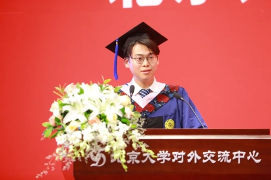

尊敬的老师、亲爱的同学、各位不远万里前来的家长们：

下午好！

我是社会学系2021级硕士班的徐毅萌，今天代表硕士研究生们发言，我感到非常荣幸与激动。这一届的硕士生们或居住万柳，或在外租房，多数同学与此间的校园尚未亲近，告别的时刻却忽在眼前。所以比起谈我们与燕园的故事，我想从我们共同的境遇说起——相较本科或博士，硕士更似过渡阶段，人生诸多选项徐徐展开，清晰或迷离、得意或失意，众生百相。

在八个月前，我申请了十来所西方大学的人类学博士项目。北美的研究生院往往要求申请者多交一篇小作文，谈生命经历、学术理想等等。我在结尾处引用了人类学家蒂姆·英戈尔德的一段话：

所有真正的学者都是驴子：倔强、多变、执拗、好奇又任性，同时被他们所处的世界吸引、为此惊奇。他们不会被催促，而是按照自己的步调前进。他们生活在希望中，而不是陷入确定性的幻觉。他们的道路可能多舛，无法预测。他们会找到事物的本质并追随着，在追随过程中寻找到自己。

在四个月前，申请季尾声，虽有些许收获，但不甚中意；经过一番自我拷问，我决定暂别学院生活，前往蓬勃的非洲新兴市场工作。再次回顾文书的结尾，这段话好似早已写就的箴言——寻找自己的步调、生活在希望之中。

 我想邀请在座的毕业生们回忆一下，在多年前踏入北京大学大门的时候，可曾设想自己的下一站在哪里？那理想的地点、行业与当下的情形是否重合？重合才是极小概率事件吧。大家又可曾在系里的展板前驻足过呢？七年前我在社会学系的第一次班会时的“系史教育”，在展板前与中国第一代社会学人类学家的生平相遇。费先生可曾料想过在负笈英伦前的花篮瑶调研，会经历丧妻之痛，又在疗伤中成就经典？杨庆堃、瞿同祖先生可会料想跨越太平洋西去或东归的旅程会意味着怎样深彻的人生改变？那一代学人又可预料在迁入燕大校园后，便辗转昆明，颠沛流离，在数十年后还要重建学科？意外与时势左右着他们的生命轨迹。

我们多数毕业生都在中国经济增速最快、全球化之梦最真切的年代里记事、成人，现代性整饬着我们对时空和秩序的想象，似乎前辈们的漂泊不定早与我们无关。带着确定性的幻觉，我们习得筹划未来的现代时间性，习惯于彼此参照，也习惯于参照着社会性的时间轨迹。

不过过去的三四年时光，闯入生活的变数相信已不必多说——比如实习遭遇中断、最初认准的行业不再景气、曾经向往的院校博士缩招、职业晋升的竞争更为激烈……我们或多或少感到过焦虑、疑惑、彷徨、无措、甚至愤怒，这些时刻提醒我们唯一确定就是不确定性本身。

在毕业季时，研会、学生会组织经验分享，我在帮忙张罗联络时感触最深的是，在“干货”之外，我们也非常希望分享一路的困惑。因为在“有用的信息”里已经抽离出有血有肉的人，以辉格史的方式叙述成功，但恰是如何在众多选项中彷徨摇摆——是否要去海外读书，是否要进体制，申到博士后再审视这个选择而忧虑——才是特别鲜活的。因为迟疑中的思索，引向了最重要的问题：我究竟想要过怎样的生活。

这个问题可能会长期处在未完成、未实现的状态，那么我们不妨勇敢地承认和接纳此刻体会到的迷惘，也不妨记住布洛赫的教诲：学会希望。希望的姿态，不同于紧锣密鼓地筹划：它既不固守特定的执念，不沉溺于机会的消失，也不禁锢于不满和虚无；它引导我们看到新的潜在的存在，正暗流涌动着，等待被渴望、被追寻、被照亮、被实现。在希望之中，我们珍视此刻既有联结——与朋友、与土地、与历史的联结，并以蜷伏的状态，敏锐地观察世间的动向情势，对尚未存在的可能性保持敞开。

幸运的是，我们的学科教育正具有这样的敞开性。倾听报道人的言辞，与他们对话，参与他们的日常生活，这不单单是收获特定的研究数据，这是在实践和道德上蒙受他们的给予。或许我们难以在研究过程中寻找到特定的答案，而学理的讨论终会在某一刻回到研究者自身，领会知识的限度和生命的韧性，并启发着我们如何带着希望，在不确定中过着普通的生活。

 此刻，我们将要从社会学系毕业了，生活的冒险还在继续。希望大家都能像驴子一样，笃定又固执、对世界感到惊奇，按照自己的步子坚实地行走。

或许在毕业后的某一刻，回想到曾经热热闹闹、叽叽喳喳的智识生活，会感到孤独；不过这段旅程中相遇的朋友们，即使分散在天南海北，仍在彼此眷念牵挂——孤独的人们，也将会并肩前行。

即使途中真的遇到不得志的时刻，深陷自身无法左右的困局，希望我们仍可以豪情万丈、天马行空，大不了就高歌一曲我们系友所作的《长铗》吧——

长铗，归来乎。食无鱼、出无车……

从今后对酒当歌，乐得逍遥回故乡。 

这样的气魄，正是怀抱希望的立场。

理想、坦荡、从容、无畏、自在。
