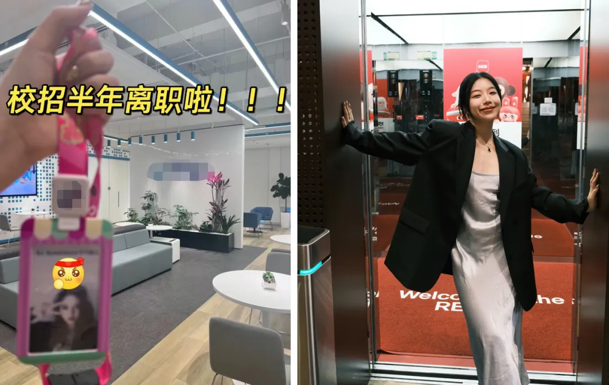

▲ 点击蓝字，设为星标，以防失联

  

今年3月，一篇标题为“100个赞就离职”的帖子火了，

这篇帖子最终收获了28万网友点赞，

发贴者也从公司裸辞，

成为了一名离职博主。

“离职博主”被称为是2024最拥挤的赛道，

甚至出现了阿里、腾讯、字节的细分领域。

小红书上，“我离职了”的话题

在今年上半年浏览量破亿。

晒工牌、拉横幅、发公司合影，

越来越多人试图以“离职”为起点重启人生。

▲

左：Claire茶仔离职时晒出了工牌

右：一小波离职时与公司电梯合影

▲

莫妮卡被腾讯裁员后去了门店做兼职

一条和6位大厂“离职博主”聊了聊。

有人40岁被裁员后去门店叠裤子；

有人离职半个月赚到从前两个月的薪水；

有人发文吐槽公司引起热议，

导致前部门内部整改；

也有人拥有20万粉丝，收入翻了5倍，

却感叹“比大厂上班更累”。

挤入“离职博主”赛道是一个明智选项吗？

听听她们的体会和感悟。

编辑：马诗韵

责编：陈子文

▲

Claire茶仔在字节工作时拍下的窗景

“在离职赛道我算头部的，当时离职闹得蛮大的，”Claire茶仔说。从字节跳动离职半个月前，她因为一篇吐槽字节的帖子在网上火了。

在爆料贴中，她披露了不少“大厂槽点”：员工错峰怀孕、做手术也要写日报、领导任用“嫡系”员工……作为2023届校招员工，她放弃了转正，同时放弃的还有应届生身份和落户机会。

“我一开始没有想过做离职博主，初衷是让更多人对大厂祛魅。”她的帖子得到了近3500点赞，引发了巨大的讨论和共鸣，也受到了字节高层的关注。Claire茶仔所在的前部门因此整改，“不要求打卡了，日报也没有人指指点点了，每晚七点半要上的课也取消了。”

▲

离职前一小波在工位和公司楼下分别留影

“流量是互联网大厂给所有员工的最后一项福利。”另一位离职博主一小波说。5月底，她从工作了三年半的小红书离职，“再待下去的话，人的价值感会不断降低。”她家距离公司只有一个路口，300米。状态最差的一段时间，她每天早上走到路口“都要深呼吸半分钟再去上班”。

离职第二天，她在小红书宣布了这个消息，同事也留言送上祝福，“离开新天地，走向新天地。”凭借这篇帖子，一小波在一晚上涨了300多个粉丝。

平时，一小波一直有在社交媒体分享生活的习惯，因离职受到关注纯属偶然。然而作为从业多年的“互联网老驴”，她敏锐地嗅到了“小红书前员工”身份带来的流量优势，“大家会问我很多专业问题，比如怎么运营小红书账号，所以我开始分享一些干货。”

▲

一小波和朋友录播客分享自己的直播经验

近两年，随着各家大厂降本增效，裁员的消息时有爆出。一些员工认为，大厂的红利期已过，如今这已经不是一份有高性价比的工作，因而主动出走的人也不在少数。在众多因素影响下，离职博主正成为2024年最拥挤的自媒体赛道之一。

“数字游民”“前大厂员工”“gap year体验者”，都是常见的离职博主人设，其中“大厂”仍是最吸睛的标签，甚至催生出了“大厂离职博主观察员”，以观察1000位字节离职博主为引流方式。

“在大厂工作过，你就获得了天然的流量基因，就像有人会把毕业学校一直写在简介里。”一小波说。

▲

“默默努力の生姜”离职前后对比照

从2019年就在网上分享大厂生活的“默默努力の生姜”（以下简称“生姜”），可以算是第一批大厂博主。“那时候大家都梦寐以求去大厂工作，发任何大厂相关的内容都有人回应，吸引来了很多粉丝。”

生姜的确吃到了大厂的第一波流量红利，如今她在小红书拥有20万粉丝。从大厂离职后，生姜没有第一时间向粉丝宣布这个消息，“我想着也许还会再回大厂。”直到去年下半年，随着其他事业稳步发展，她觉得“可以坦诚跟大家讲了。”于是，她又吃到了“离职博主”的大厂流量红利。

生姜的经历提供了一个理解离职博主赛道的角度，大厂的标签热度仍在，但随着大厂的光环逐渐黯淡，大众爱看的流行叙事也从“卷在大厂”变成了“逃离大厂”。

▲

ruolan在离职一年后回顾裸辞生活

“离职前的几个月，每天早上9点的通勤路上，我都会刷离职、裸辞的内容。先看一看别人的经历，寻求一点经验。”ruolan说。毕业后她通过校招进入腾讯，成为了一名程序员，“当时没有经过什么思考，只是觉得有一个还不错的机会就去试试。”

▲

ruolan在练习瑜伽

直到开始学习瑜伽，她才觉得找到了自己喜欢做的事。如今，她是一名取得全美瑜伽联盟RYT200认证的瑜伽教练，去年6月离职后，她经常在社交媒体上分享转行后的生活。

“可能有些人跟我原来一样，在每天上班的路上纠结要不要离职。我身边也有朋友和同事很想离职，但是没有勇气。我分享离职相关的内容，是为了让有这个想法的人知道，选择离开不等于失败，人生也不会完蛋。”

▲

“莫妮卡住了”被腾讯裁员后去lululemon做店员

同样抱着利他心态成为离职博主的，还有在腾讯工作11年被裁员的莫妮卡。4月底，她在小红书发布了第一篇笔记，“40岁被裁员后，我到lululemon叠裤子啦”，这篇内容目前拥有20万浏览量。

一个前同事刷到了她的帖子，难以置信，“以为只是为了运营自媒体编故事，直到有一天来门店真的看到我在叠裤子，他当着我的面说不理解，跨度太大了。”莫妮卡说，“现在的就业环境对35岁以上的职场人很严苛。经历了巨大的职业转变之后，我想记录当下并告诉大家，还有很多路可以走，不一定非要坐在办公室里。”

▲

莫妮卡用裁员赔偿金买了车

现在，她每周工作24小时，业余时间用于副业、健身和经营账号。她分享店员的日常工作，也给同样想去“叠裤子”的网友传授经验，“有人通过我的分享顺利入职了lululemon。”

成为离职博主的两个月里，莫妮卡积累了1400个粉丝。对她来说，变现是顺其自然的事，当下更重要的是“分享在40岁怎样面对生活的各种挑战”。

不过并非所有离职博主都是这么想的，“大家都想把以前的技能变现，互联网人会的不就是互联网这套吗？比起加盟奶茶店、火锅店和开服装店，做博主是一个最轻成本的创业，有网络就可以。”灵月说。她是十年大厂人，今年4月被裁员后去了中亚旅居，同时经营着社交媒体。“我给自己一年期限，不成也没有问题，到时候我会去找一份别的工作。”

▲

“灵月真棒”被裁员后核心收入源自各类兼职

灵月从大厂离职前年薪50万左右。做离职博主的第一个月收入只有360元，一共只接到三条广告——相比其他新人博主已经很不错。但是由于粉丝量不高，单条广告报价只有120元，收入暂时还无法和在大厂工作时相提并论。

在受访的6位离职博主中，赚到钱和没赚到钱的约各占一半。Claire茶仔每个月平均接7-10条广告，这为她带来了2-3万的收入。一小波凭借离职的热度与此前积累的直播经验，又恰逢618，找到她的项目没有停过，半个月内她赚到了之前两个月的薪水。而莫妮卡与ruolan则尚未变现，仍处于积累粉丝的阶段。

▲

一小波离职后仍在接直播相关的项目

流量与变现之间，并不划上必然的等号。开头提到的带着28万点赞离职的博主“阿颖啦”，在离职初期热度很高，每条笔记都能收获4位数点赞。但是她没有选择继续做自媒体，而是去大理做民宿管家，之后便暂停了社交账号的更新，她的最后两条笔记点赞数都没有超过100。

“这两年感觉大厂打工人的人设泛滥了。”第一批大厂博主生姜提到了转型的重要性，“一开始我是大厂vlog博主，后来觉得我不能永远依托大厂这个title，就转型成了好物推荐博主，事实证明这次转型后面带来了很多广告。我的自媒体收入是比工资多很多的，平均是之前月薪的3-5倍。”

▲

Claire茶仔晒出当月自媒体收入近3万块，同时她还在充实自我

无论是否靠自媒体赚到钱，所有受访博主都告诉一条，她们没有将这作为一份全职工作。有人已经重回职场，有人同时在做好几份副业。

“我本职工作的工资也很高，我挺满意现在的状态的。我应该做的是探索更多可能，而不是赚到钱就离职，一心扑到做博主上。”Claire茶仔说，她目前在一家半导体芯片原厂工作，这里和字节的氛围截然不同，“职业体验挺好的，能学一学原来我完全没有涉猎过的领域。”

在一小波看来，离职博主的账号更像是自己的一张名片，“让别人看到我的工作能力和表现力，让更多人认识我。我还没有制作介绍PPT，就已经有人联系我合作。”

▲

灵月目前正在中亚旅居，同时经营自媒体账号

站在旷野上久了，焦虑感也会随之而来。离职初期，灵月每天睡到中午起床，过着一种与外界脱节的生活。渐渐地，她发现自己和朋友聊天不再同频，意识到不能再这样下去，开始制定严格的作息表：每天固定时间起床；在别人工作的时间，她也忙着做副业，“别人周末休息，我周末还更新社交媒体。大节奏跟别人一样的情况下，就会好很多。”

一小波也在离职后保持着相对固定的工作节奏，每天早上11点到家楼下的咖啡馆办公，一直待到下午四五点。“像上班一样忙，但也有享受生活的时间。吃完饭天还是亮的，收工的时候可以看到夕阳，很有幸福感。”

▲

离职后，莫妮卡有了更多时间来健身

不少受访博主都提到了一个观点：离职博主或许是个伪命题，因为离职只是一个起点，却不能成为终点，“这肯定是一个流量密码，但是你不可能一直在离职。”

被算法选中后，如果不能持续输出算法青睐的内容，那么很快就会被算法淘汰。于是凭借第一篇离职推文火了的博主们，纷纷试图转型，延长自己作为博主的生命周期。有人开始知识付费，提供修改简历等服务；有人转型为家居、美妆、旅行博主，靠商品植入和直播赚取收入。

▲

生姜认为离职后有了更多自由，同时生活和工作的边界也被模糊了

但生姜奉劝大家不要跟风做离职博主，“我是验证过自己可以靠自媒体变现才敢裸辞。”尽管她是受访博主中转型与变现最为成功的，但她觉得做博主其实更累。“生活跟工作没有一个明确的边界，所以工作的时间更长了，我可能随时随地都在发微博。”

“上班意味着旱涝保收，做博主是自负盈亏。没有投入什么成本，也可能没有什么回报。我一直告诉粉丝，有可能你并不适合脱下长衫。”莫妮卡说。

如果说大厂是轨道，那么离职博主似乎正在成为另一种披着“旷野”外衣的轨道。一小波总结了小红书上的离职流量公式：工牌照、离职证明、公司门口照片，“还有离职前后对比照，先发一张丑的工位照，再发一张变身照。”

▲

“#我离职了”话题页面

在小红书上搜索离职相关内容，从标题、封面图再到内容的同质化正在变得越来越高。一旦一个标签被算法证明是成功的，就会有更多人使用这个标签，直到把它变成一种可无限复制的模版。而越来越多人挤入离职赛道，或许本身也映射了年轻人对于旷野的想象越来越同质化。

最近，一段余华对于“旷野”的采访在网上得到了大量转发。他提到自己年轻的时代，“那年找机会找旷野太容易了，当年的大学生毕业都是香饽饽，到处抢。对他们来说不愁旷野，只愁那个轨道太窄。”

“你现在会觉得对年轻人（而言）旷野其实变少了吗？”主持人继续问他。

“原来一个人面对10个旷野，现在100个人面对一个旷野。不是旷野少了，是那个想去旷野的人太多了，”余华回答，“现在年轻人变得更难了。”

▼

  

