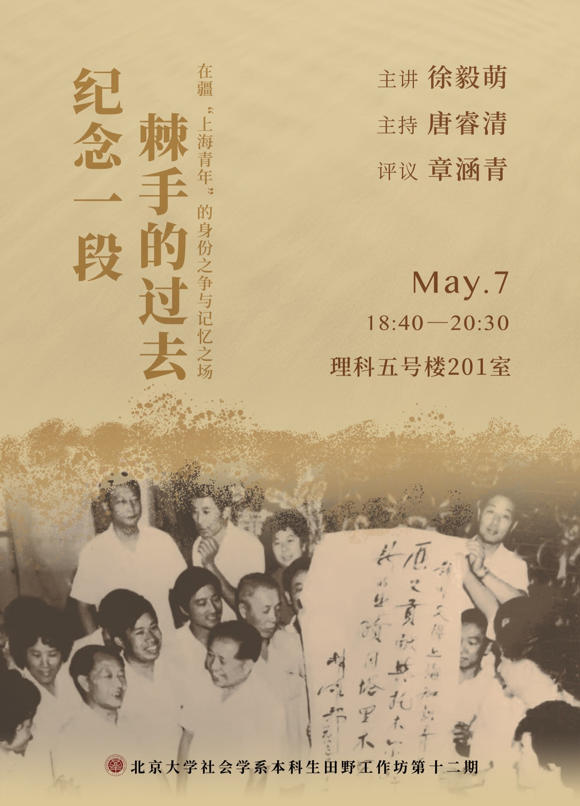
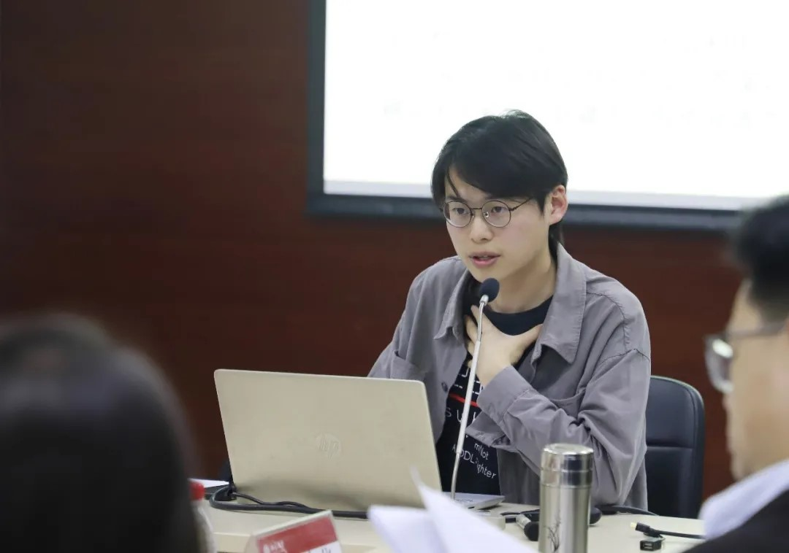
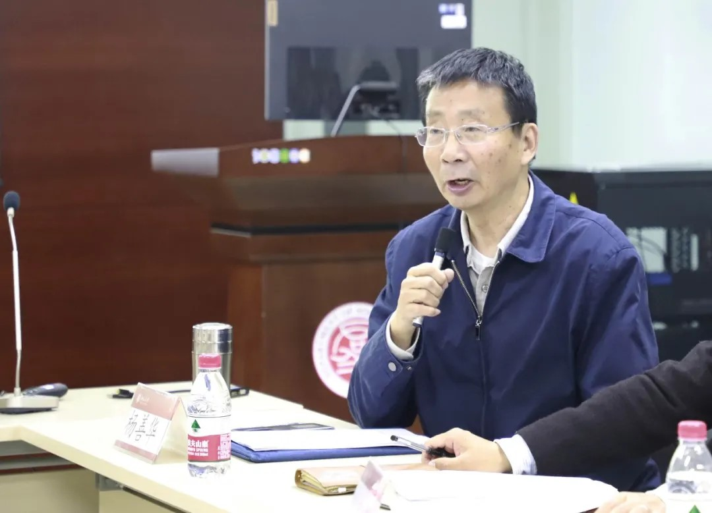
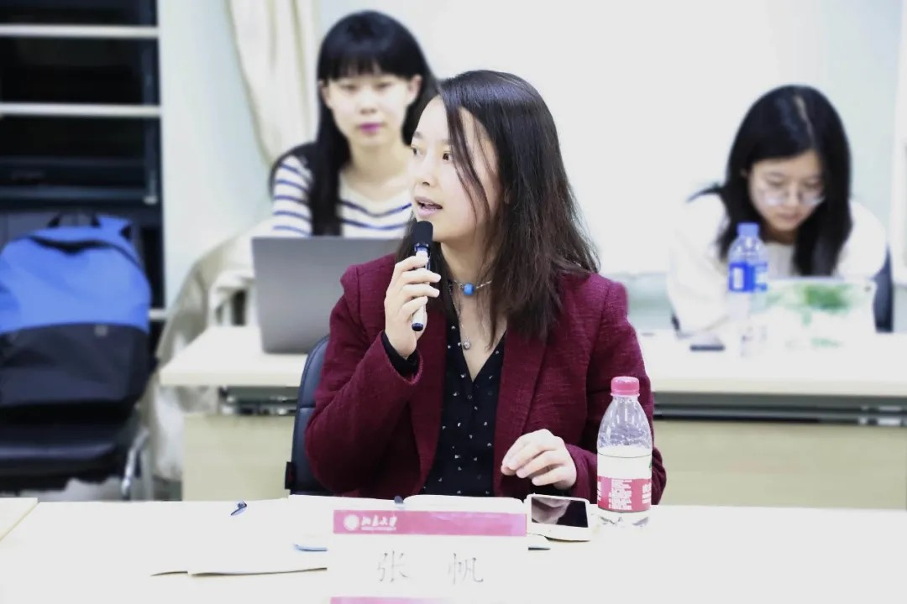
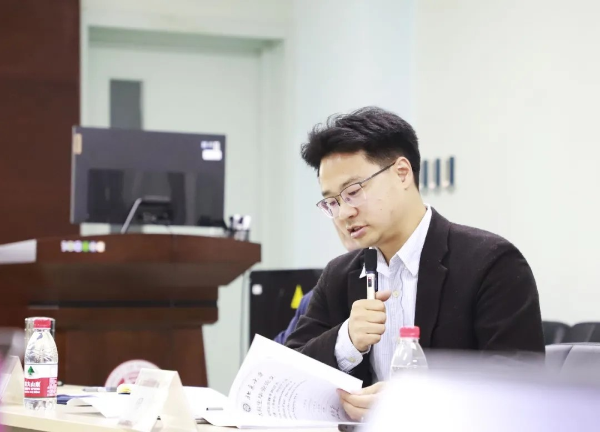

 

2021年5月7日晚，第十二期北京大学社会学系本科生田野工作坊在理科五号楼201室举行，主题为“纪念一段棘手的过去：在疆‘上海青年’的身份之争与记忆之场”。社会学系本科生徐毅萌主讲，唐睿清主持，硕士研究生章涵青评议，北京大学社会学系教授杨善华、助理教授田耕、助理教授张帆出席并参与讨论。

内容回顾

选题过程

我来自上海远郊县，关于“上海人”的身份是随着负笈北上形成的，另外我也对发生地域的“移动”有着莫名的热情。于是最初我希望做一个关于身份、空间跨越的题目，于是从引起上海万人空巷的电视剧《孽债》，联想到了做一项关于知青子女的生命史与地方体验的研究。同时大二学期，本科生“历史社会学”课程中“记忆与叙事”专题，以及课程参考文献给予我大量的启发，甚至醍醐灌顶。

由于我的外祖父母生活在远郊的农场，我母亲的初中同学中不乏知青子女，这为寻找访谈对象提供了便利。进入农场之后，我发现比起寻找父母的同辈人，与老一辈亲历者展开交流更便利、更具可行性。在初步访谈后，我发现其中一批经历特殊的群体，于是将关注点细化在1963-1966年成建制动员到新疆生产建设兵团的10万上海青年，并且围绕他们的“支边青年”与“知识青年”的身份展开梳理，又进一步关注到他们的民间的社群分化，以及记忆实践的空间营造、纪念仪式等等。研究陆续进行一年有余，追寻其身份之争，以及记忆空间的多重表述，分别完成本科生科研结题报告与本科毕业论文。

 

背景与田野

进疆上海青年与一般知青研究关注的对象有诸多不同，这些差异性要素构成了我最初试图展开研究的原因。他们作为城市青年下乡，早于一般知青研究关注的68年“老三届”的知青；而在70年代末、80年代初回城风波开始时，在疆的上海青年曾步云南版纳知青后尘，多次在疆、沪、京多地进行集体行动，甚至不乏激烈的冲突。然而他们最后成为上山下乡运动中“留在沙滩上的小虾”，是极少数被要求大部分稳定在当地的群体，他们与子女为争取定居回沪、为争取退休金、社保的努力延续此后的30年。他们漫长的边疆生命经历，仅从生命历程角度便有异于知青研究中“青春有悔/无悔”的经典讨论。

上海青年在疆工作之处为新疆生产建设兵团，兵团与王震及三五九旅进疆转业，屯垦戍边有着密切关系。进疆的10万上海青年中近半数安置在兵团农一师（现称第一师），上海人曾经构成当地农垦职工的近半数，带来科教文卫领域的发展，而此地也正是集体行动的主要发生地。世纪之交时，留疆上海职工系数退休回乡，而农一师阿拉尔市在“白地”上进行新的城市建设，诞生拥有“礼制中轴”的纪念碑时的军垦新城。

围绕这一群体与疆沪两地，留下一段冲突性的、被压抑、存在多重表述的过去，我将其称之为“一段棘手的过去”（a difficult past），那么如何对其记忆，如何进行纪念就成为一个问题，也构成我的重要推进线索。田野过程中，从2019年的历史社会学课堂深受触动到2021年春季论文写作，其中经历了2019年田野前本研项目的申请，2020年初的初涉田野而在大疫来袭后中断研究。在2020年暑期，我遭遇了关键报道人，发现编纂记忆的知青精英社群，并孤身在南疆阿克苏、阿拉尔等地调研访谈，参与在上海的纪念和重聚活动。

写作经历

在初涉本研写作时，受到记忆研究中一些针对“棘手过去”的个案分析（比如越战纪念墙、北爱民权运动、拉宾被刺等）的启发，也在后续的写作中受到皮埃尔·诺拉的《记忆之场》的影响，尝试锚定一些物质性的纪念空间。

最初我尝试就回城风波时“支边青年”和“知识青年”的“名分”的争夺进行梳理。研究中关注到这些进疆“上海青年”中存在不同社群，有着价值与立场的分化。如果从国家\-民间对立的传统框架下，我们容易天然地认为民间社群往往坚持可以享受回城政策的知青身份，并对抗争加以肯定；然而这一表述也是存在分化的，在田野中我也遭遇到坚持自身就是“支边青年”、“支边职工”身份的民间精英。因此，处理各个群体之间的立场分歧，理解他们如何加以回忆这段冲突性过去的不同方式和行动逻辑成为至关重要的问题。在写作中，首先从上山下乡运动的历史背景进行梳理，讨论存在的不同分期方式的背后的意义；再对不同群体的记忆编纂者——我称之为“记忆代理人”——进行关注，洞悉身份、认同、记忆之间的张力。

记忆生成和维系也需要通过特定的仪式、节庆、纪念碑、博物馆而加以保留。这就意味着对集体记忆的研究不仅仅局限在文本媒介中，更需关注“物质性”因素，这些“记忆之场”都是对过去的表征。

后续我将前往南疆的实地调研纳入写作中，从多重叙事向多重物质空间的呈现上进行拓展，关注着冲突的、难以言说的过去是否能够表述，谁在表述，如何呈现，谁被表述，以及叙事之调和身份合法性的争夺。最显而易见的是农一师的军垦城市建设，在这座具有纪念碑中轴的“礼制城市”，城市记忆的营造围绕屯垦戍边的红色基因展开，我关注纪念碑和纪念馆中处理上海人的到来的方式，以及记忆装置的受众。与此同时，塔里木河畔上海知青林的建设和上海的知青博物馆也引起我的关注。前者由新疆上青中的政治文化精英主导，甚至正在进行知青纪念墙的项目，后者地处偏远，则成为冲突性过往得以储存的地方。

在纪念装置建造之外，我也回到大规模记忆仪式。大型仪式中得以容纳不同立场的社群，他们如何合作和实现共识是我的关注点。一部分老知青采用跳维族舞蹈（新疆舞）的方式，重建自身身份的认同，成为游离在新疆与上海之间的暧昧身份后的选择。这些身体、空间的细节共同展现出处理这段生命历程、历史记忆的复数形态中非常生动的一面。

现场问答

问题一

问：我的一个困惑是似乎觉得记忆研究很难超越以往的研究，现在的研究围绕着比如历史为什么分叉，出现不同的调，又遭到怎样的操控，怎么通过口述拯救历史等等……我好奇的是未来的进路在哪里？从哪里吸取资源？第二稿毕业论文比本研论文尝试添加一些景观、空间之类，甚至人类学里的资源，拓展传统的研究，哪些是实质性的？

答：在钱力成老师的文章《记忆研究的未来》里，他提到要避免让记忆研究成为一个“添加性工作”（addictive work），不能不停地补充一个个新的个案，不是“故事会”，而是可以关注意义与意义实践，关注时间性等，在历史社会学和文化社会学之间寻找一个连接点。我自己觉得自己也没有完全走出添加性工作之中。不得不承认，我在写作的时候也很纠结，因为在材料组织上，材料过多也是一个比较困难的问题，我采取的方式可能并不是最程式化的那一种，但可能并不是这么处理。空间、场所是一个拓展的方向，但也发现自己对物质性的把握仍然不够敏锐。

问题二

问：进行口述访谈时，有时访谈对象即使对自己亲历的事件，也会有夸张、美化的成分，或者是模糊之处。面对这些二手材料如何取舍与筛选？又比如在“美篇”等软件上，他们的表述会与日常的表述有很多不同，我们如何处理这些平台上获得的材料？

答：在做记忆研究处理这些材料的时候，可能就是暂时悬置了对“真相”的追求。研究者首先要阅读大量材料，知道这一事件的大致的图景，带着开放的姿态面对受访者记忆叙事的美化、模糊或遗忘，在与对方交流的过程中不断修正这个图景，然后再进行判断：他愿意跟我们讲哪些部分？以何种调子讲这件事？相比于事件本身是怎样的，我们更关心他们为什么这样记忆、这样表述。

评议与讨论

  

章涵青：

毅萌的论文在不停地修改，从本研到毕业论文再到田野工作坊，文章的标题就有好几次变动，题目中“艰难的过往”变为了“棘手的过去”。这里可以看到一个贯穿整篇文章的问题：“difficult pasts”。“difficult”怎样去理解？“past”是单数还是复数？记忆研究中强调记忆的复数性质，涉及记忆与遗忘的问题，以及多表述的、彼此争议的叙述。各种群体不断对记忆进行争夺，不同叙事之调存在过去与当下的缠绕关系，这在整个记忆研究中也是特别重要的问题。处理复调记忆的复杂性和多样性既是记忆研究的困难，也是其魅力。

我们把人放到更大的环境中去理解，需要有一个整体性的思路，我觉得这是在田野中很重要、很综合性的思路。毅萌的田野材料非常丰富，不仅有文本型的材料，还有很多非文本型的材料，访谈、记忆的实践、回忆的空间等等。文本和非文本的关系中，有更多其他学科的知识可以补充进来。比如博物馆研究对文本和表征的分析，不仅关注文本本身的叙事逻辑，还关注展览文本的生成过程，包括空间的形态，以及装置、展程等各种元素如何形成展览的整体逻辑。看展览的人是什么样的群体？他们的知识背景如何？在看展的过程中如何形成进一步的观看和凝视？毅萌已经有意识地涉及对纪念馆、展览的分析。另外，文本叙事和非文本的空间共同处于记忆之场中，它们之间是否存在一些交互？这是“记忆之场”的概念落到田野中时可以关注的问题。

毅萌文章最后的反思让我们思考，“复数的声音”所代表的全貌中都有哪些人？田野中有很多看似在聚光灯下的人，比如精英，他们可能会成为进入田野的渠道。但这也提醒我们在分析它们的叙述时，要持比较谨慎的态度。“无名者”是一个很好的启示：无论多么深入到底层，都会有人处于始终无名的状态；我们需要一层层剥开，深入“无名”的过程之中，不断找到叙事中多样的声音。

 

杨善华老师：

我读毅萌的文章很亲切，我是上海知青，当年下乡差一点就去了新疆，毅萌讲的很多事情，我都是亲历者或目击者。他的调查做得非常不容易，从奉贤五四农场迸发这个想法，在新疆什么人都不认识，只拿着几个电话就跑到阿克苏去调查。整个田野过程不折不挠，能够访谈这么多人，我们从中可以体会到社会学的献身精神。

毅萌试图写成历史社会学的体裁，记忆研究中，前人研究太多了，是和其中的哪一部分进行对话？我认为和前人研究的对话点应该更加清晰一些。对于材料的处理，我很赞成毅萌关于历史和记忆的观点，这是社会学和历史学非常大的区别——我们问的是对方为什么这么讲，而不是先追问他讲的是不是真实。我们并非不关心真实，但在访问一些人之后，可以发现他们的共性，这些共性就是“真实”。这样的方法也体现了社会学的洞察力。我们每个人都会美化一些东西，但美化的背后有一个想法，这个“想法”值得我们去追究。

  

张帆老师：

我特别喜欢徐毅萌的文字，文字感很强，对田野材料的呈现度非常高。大家听了毅萌的讲述，可能会觉得和我们平常的田野不太一样，这在人类学中叫多点民族志。他们有的在上海、有的在新疆，没有一个固定的社区。这是一个做民族志的新方法，这个方法的负面效果是民族志可能流于表面，社区感缺失导致地方感的呈现不足。你的文字中少了一点烟火气，所能呈现的只是对当时事件的回忆，这些回忆没有一种整体感、地方感和社区感，所以文章中的很多分析很难处理针对某一个事件的零散材料。这是多点民族志面临的共同困境。

毅萌把多点的分析固定到了具体物品上，将博物馆、空间、纪念碑的研究融入到了你的口述史中，这一点非常好，给了它落地的感觉。博物馆空间的设计、展品摆放的顺序、物质材料的使用，背后都有其象征意涵，你对文字高度敏感，但对空间中的物质关注并不充分；文字分析非常好，而象征分析可能不够。博物馆研究有很多不同的进路，有一些只看”前台“，研究博物馆的展程；有一些研究博物馆的“幕后”，即博物馆是怎么被组织起来的。在社会学和人类学的研究中，我们可以关注前台和后台是怎么合起来的；也可以找到博物馆的策划、资方、施工、物品提供方来访谈，把空间本身的物质性呈现地更充分。

你在文章中反复提到“复数”。与巴赫金的“复调”对比，这两个概念呈现了很不一样的历史观。前者认为，有多种不同的叙事，这些叙事是平行存在的，它们平行呈现了复数的“pasts”；“复调”是“past”之间的交响乐，它们互相之间有对话。个体的历史感从哪来？国家提供了一个框架，是个体形诸记忆的一个起点。不仅是国家，公共空间、建筑、各种象征符号，都成为个体构建记忆的场所。个体之间不是割裂的，一定有交互的关系，可以通过研究呈现它们对话的形态。

再说“历史”。我们为什么研究历史？一段历史会遮蔽或掩盖或扭曲一些东西，我们用社会学或人类学进入这段历史，是为了还原遮蔽或扭曲的东西。这是目前记忆研究和历史研究都非常常见的路径。我们是否可以有所推进：研究历史，是不是要问背后的社会学概念或一些更普适性的概念？哈布瓦赫明确指出，他研究记忆是为了研究社会性是如何生成的，关注的是“社会”这个概念，而不是简单地停留在展示一段历史。我们想关注的，可能更多是个体和群体之间的关系、社会和国家之间的关系、社会何以可能、人之为人如何实现等等，这些更加核心、普世的东西。

  

田耕老师：

我很赞成前面杨老师说的，毅萌的研究体现了非凡的毅力和勇气；我也同意张老师的观点，文章中是少了一些烟火气，这个烟火气包括他自己，比较难以从文章中看到他研究过程中体现的激情和奉献。毅萌读的有关记忆的研究实在是太丰富了，导致在写作时把文字的空间留给了诸如“复调”等等理论的讨论，切割了非常热情的企图。记忆和身份是社会学中话术繁多的场域，产生了大量的“文字游戏”，但我认为“记忆”或“身份”本身是非常让人动情的东西。我的建议是可以大量做减法，削减“线性历史”、“复调”等等讨论，还有过多关于社会运动的理论资源，从而为真正的发现、穿透到最动心的部分留出空间。

毅萌两稿之间发生变化，第一稿中身份和记忆的内在困难处理是很不容易的，第二稿中出现的物质现场和空间体认，弥合了这一点，在写作技法上是很好的办法。我们回到原来的问题，“支边”和“知青”，以及“新疆”和“上海”，可以构成二乘二的表格，出现四个很浓烈的场景。留在当地的困境，回到上海的场景，还有围绕不同时间截点有个更复杂的坐标。这些材料，是一个真正的“历史之场”；可以削减技术性讨论，回到这些场景中。

“记忆之场”来自于诺拉，诺拉的写法非常有借鉴意义。《记忆之场》三卷中，每篇都呈现了一类记忆场所的写作方法，每一种都非常不同，可以涵盖你的研究处理材料的需要。毅萌的文章中将“记忆之场”作为一个隐喻使用，可以回到诺拉的写作，考虑如何呈现某一个类型的“记忆之场”，而不是这个总体概念。总体上说，我希望看到的是毅萌这种在几乎无知的状况下孤身上路的勇气，这是非常动人的部分，也继承了中国社会学重要的精神遗产。
