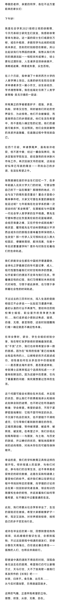

扫了一遍今年学校各院系的毕业典礼发言，最喜欢的是这篇。  

行文间叙述的不是成功，是迷茫，是迟疑，是害怕试错代价高昂，这是时代的情绪，是我们这代人每时每刻都被笼罩的氛围，是每个人都要赤身肉搏的问题，时间早晚而已。  

这些问题未必会被解决，它们终其一生也可能是“未完成”，在离知天命尚远的年少时代，手里的斧子又尚显稚嫩圆钝之际，劈开一条生路需要勇猛的心，也要伸出臂膀挽住同行人的手，这也是风雨飘摇之际能联接的最近远方，擦干泪还有笑容，破了皮还能生长，我称之为生命的韧性，远比我们想象中更耐久长。

摘录我最喜欢的一段：  

「在“干货”之外，我们也非常希望分享一路的困惑。因为在“有用的信息”里已经抽离出有血有肉的人，以辉格史的方式叙述成功，但恰是如何在众多选项中彷徨摇摆——是否要去海外读书，是否要进体制，申到博士后再审视这个选择而忧虑——才是特别鲜活的。因为迟疑中的思索，引向了最重要的问题：我究竟想要过怎样的生活。

这个问题可能会长期处在未完成、未实现的状态，那么我们不妨勇敢地承认和接纳此刻体会到的迷惘，也不妨记住布洛赫的教诲：学会希望。希望的姿态，不同于紧锣密鼓地筹划：它既不固守特定的执念，不沉溺于机会的消失，也不禁锢于不满和虚无；它引导我们看到新的潜在的存在，正暗流涌动着，等待被渴望、被追寻、被照亮、被实现。在希望之中，我们珍视此刻既有联结——与朋友、与土地、与历史的联结，并以蜷伏的状态，敏锐地观察世间的动向情势，对尚未存在的可能性保持敞开。

幸运的是，我们的学科教育正具有这样的敞开性。倾听报道人的言辞，与他们对话，参与他们的日常生活，这不单单是收获特定的研究数据，这是在实践和道德上蒙受他们的给予。或许我们难以在研究过程中寻找到特定的答案，而学理的讨论终会在某一刻回到研究者自身，领会知识的限度和生命的韧性，并启发着我们如何带着希望，在不确定中过着普通的生活。」

