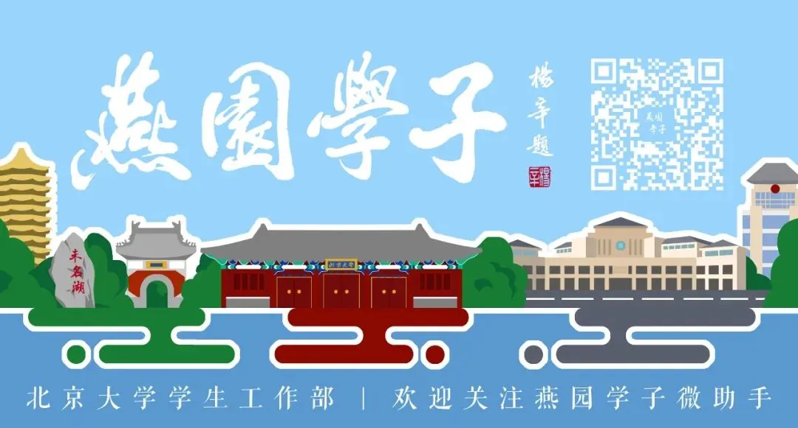
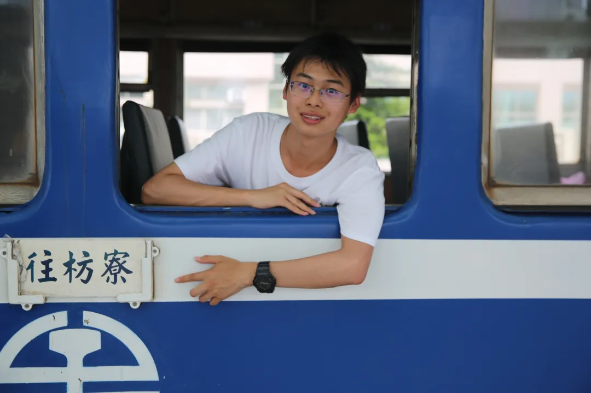
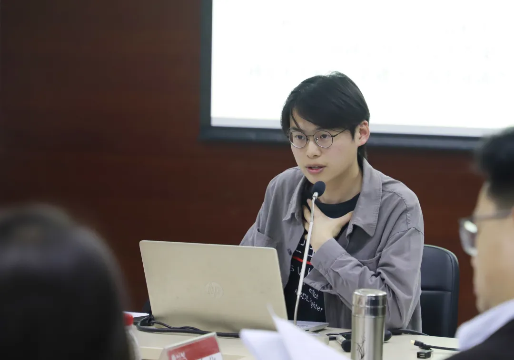
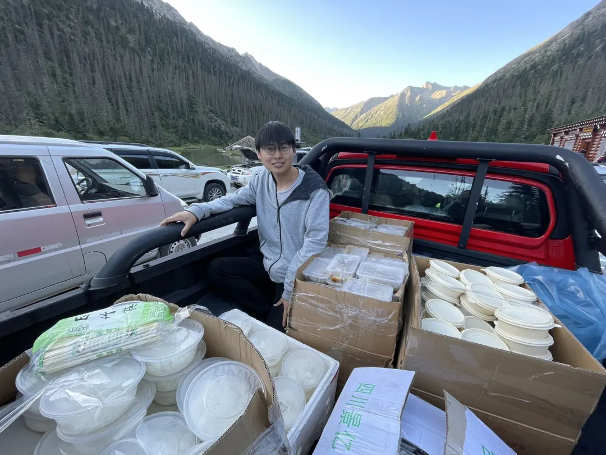

**徐毅萌，社会学系2021级硕士研究生**，1999年出生于上海奉贤，自2017年起进入北京大学修读社会学专业，曾任2017级本科班班长，2021-2022学年学硕班班长。他曾获国家奖学金，多次获得北京大学三好学生标兵、三好学生等荣誉，并获2021年度北京市和北京大学优秀毕业生称号。

**01**

**无尽山河无数人**  

七年前徐毅萌与费孝通先生的著作偶然相遇，成为他与社会学人类学结缘的起点。2021年初夏，本科毕业时他参与创作《行行重行行》纪念曲，无心插柳，这首歌曲继续在2022年北京大学社会学系重建40周年暨燕京大学社会学系建立100周年的纪念活动上传唱。他经历着这个历史性时刻，也在社会学系“五年磨一剑”，坦然踏上遥远的田野之途。

**02**

**江南塞北，寻路于中国**

学术生活是一种感召。过去五年中，徐毅萌的学分绩始终位于班内前列，而持久的积累终于在研究生一年级时迸发。

他文理兼备，研究关注知识、技术与社会、文化、生境的互动。2022年夏季，他与人类学学生合作，前往川康藏区关注民族医药的制作技术更迭及其与循证医学的知识相遇。自蓉城西行，川峦纵横，进入海拔3800米的山谷用时整整三天，行路1000公里，并完成了第一期一个月的田野调查。

从2022年8月起的四个月里，他深入东海海疆的悬水小岛，研究渔区转向水产养殖的“第二次创业”。小岛上的日子，他深入一线，坚持凌晨4点跟着大黄鱼养殖户一起劳动，乘着小船前往离岸的深水网箱一同投饵，或者是出现在凌晨5点的码头，跟包贻贝苗的老人交流，以了解地方从捕转养中面临的实际困境。

成长于上海，他却“叛逆”地关注中国边疆。本科时期，完成对支援新疆建设的“上海青年”的口述访谈后，他独自前往受访人工作过的南疆阿克苏作研究补充，他领略了兵团的万亩棉田，也深入维吾尔族为主体人口的县城，体会新时代的新疆民情。

今日他已走过33个省级行政区，出行即是考察。一路上他错过太多盛名在外的景区，却踏足无数默默无闻的县城。寻觅滇越米轨的发展转型，行至中越边境；两次行于成昆铁路，进入大凉山诸县；他多次进藏，路遇援藏干部便做起访谈；走过西海固、阿拉善，到过额尔古纳河右岸、疫情后的黑龙江畔边境小城；致力于走遍“三州三区”……他坚持作为年轻的研究者需要亲身行路，见过、听过、闻过、甚至尝过。

他坦言以民族志方法进行研究是一种“低产”方式，好的作品的诞生需要与当地保持一年、三年、甚至更长的联系，这与主流学术评价体系格格不入，但他仍在压力中坚持一份纯粹。不论“同吃同住同劳动”的田野方式，还是深入中国腹地，都继承着百年北大社会学“从实求知”“志在富民”的精神。

**03**

**服务同群，平凡之真情**

在2022年2月，徐毅萌接到了来自中华骨髓库的电话。时隔第一次无偿献血4年后，他的血样与罹患白血病的9岁男孩高度匹配。见义勇为的梦想终能施展，他欣喜于带给孩子一次重生的希望。春末夏初，他在北京疫情期间完成动员针注射，成功捐献167ml造血干细胞，成为北京市累计第502位捐献者。

如果说那是一次高光时刻，但他更强调平凡中的脉脉深情。他参与社会学系学生工作多年，担任班长期间，班集体两度荣获先进班级称号；他也曾担任系学生会副主席，将学生工作视为一种服务。他直率、坦承、细心，积极反应学生诉求，关注班内同学身心健康，偶尔在“救火”，时常在安慰。

筹备系庆期间，他协助纪念片拍摄和系庆公众号文稿整理；他也欣然参与田野工作坊，搭建交流桥梁。身为北京大学铁路文化协会的会员，他践行“立足燕园，服务师生出行”的初心，在出行高峰或者疫情交通受阻时，热心为师生提供咨询，给出预算与风险合理的返乡和回京方案。温情，便是日常的生活。

一次次上路，他能量充沛，触动于中国百姓的善良与隐忍，积累对中国发展的思考；一次次归途，在燕园的共同体里，他分享他的热情和热心。他渴求承继先辈之志，筚路蓝缕，以启山林。

来源 | 学生工作部

排版 | 叶翌阳

