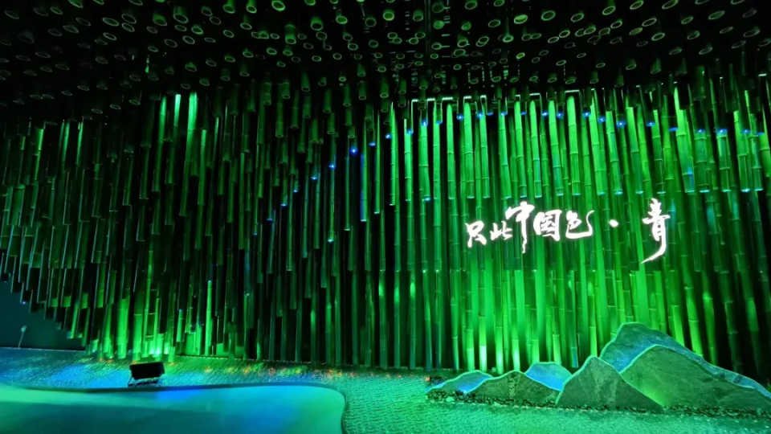
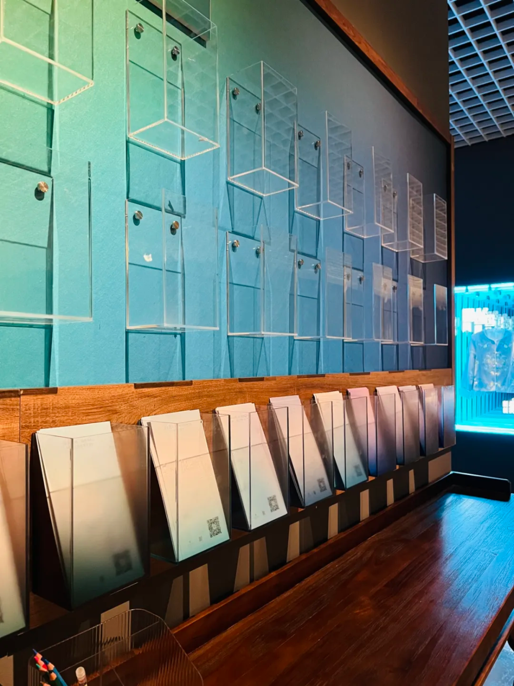
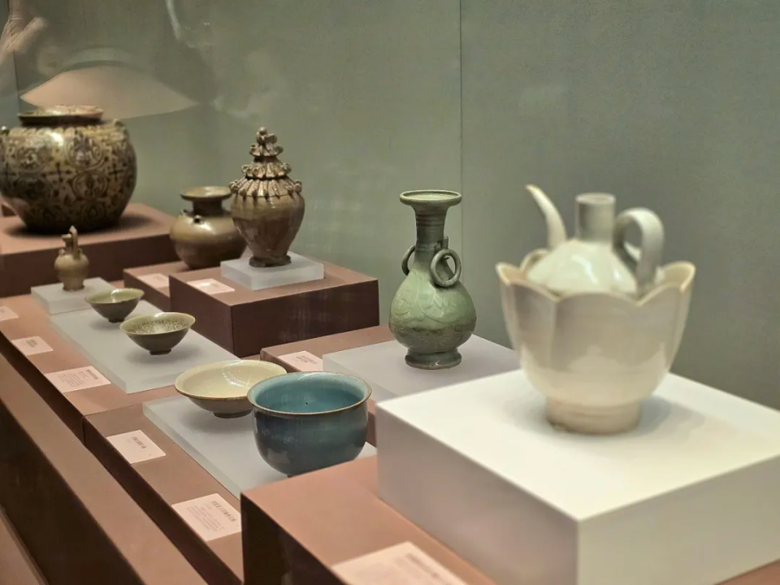
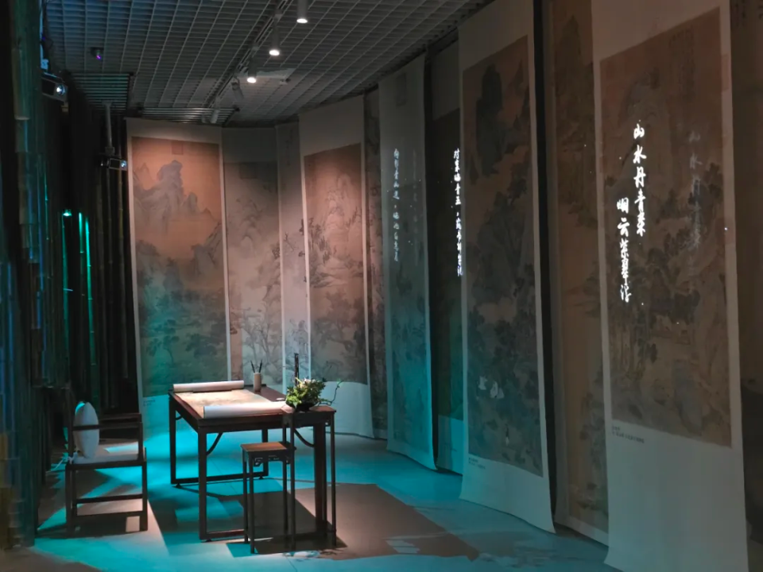
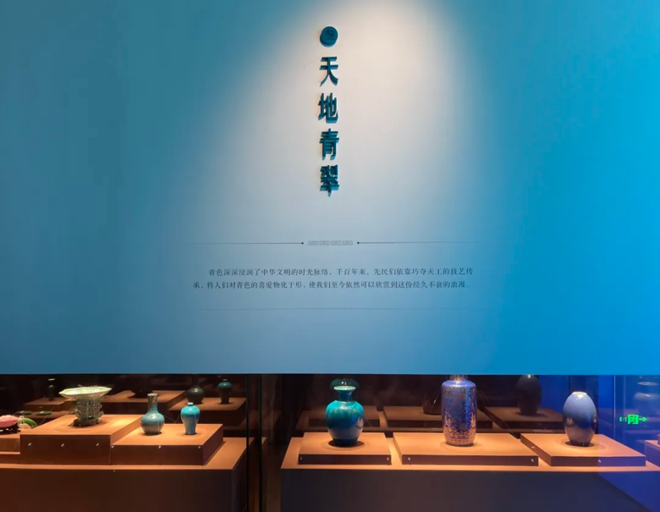
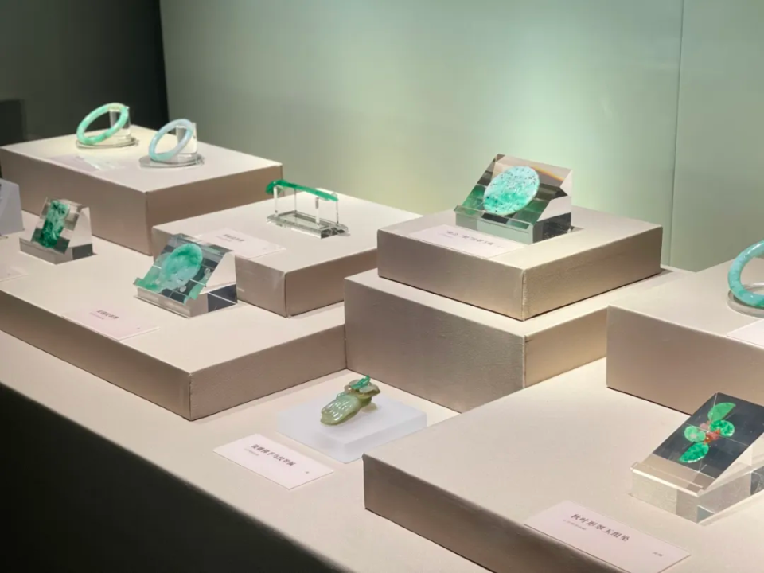
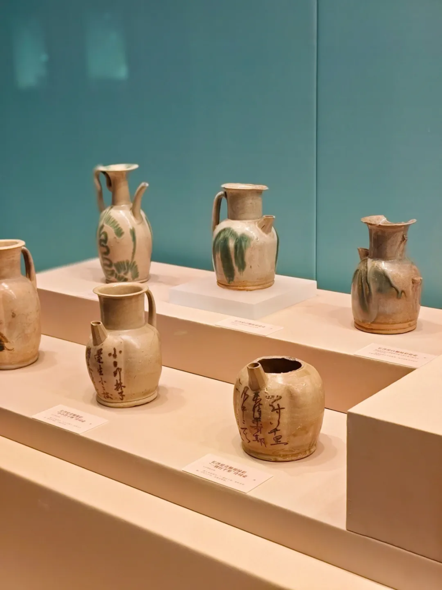
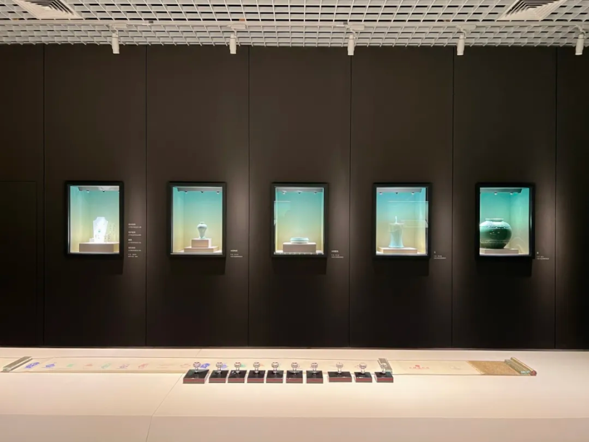
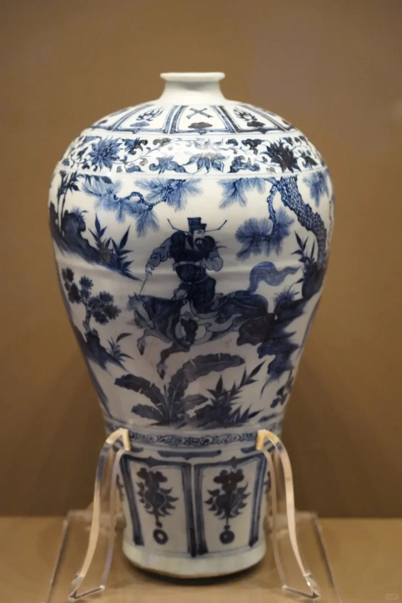
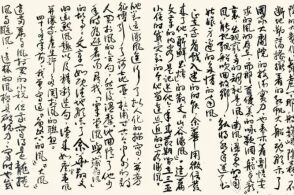

## 专题导览 | 只此中国色：在六朝博物馆领略中国人文美学魅力

青，东方色也，其色相宽广，内涵丰富，是体现中国传统文化的色彩符号。

“玉声贵清越，玉色爱纯粹。”青色，可以是浑然天成的青玉。

“明月染春水，千峰翠色来。”青色，可以是新妆如洗的青瓷。

“绿水丰涟漪，青山多绣绮。”青色，亦可以是青绿山水的国画。 

近日，六朝博物馆年度特展**“只此中国色·青”**开展。  

本次展览由南京市博物总馆、中国文物交流中心主办，六朝博物馆、南京市博物馆、太平天国历史博物馆承办。古代青玉、青花瓷、青色服饰等来自国内10余家文博机构的180余件（套）文物齐聚六朝博物馆，共同呈现一场视觉与文化盛宴。

为帮助读者朋友更好地走近本场展览，领略中华传统美学的人文魅力，2024年6月12日（周三）下午14:00，群学书院特别邀请江苏省委党校古代文学专业罗建老师为大家进行专题免费公益导览。欢迎参加。

▽

专题公益导览预告

图文来源 | **博物南京**微信公号

第一单元“何为青色”，借五色文物及青色矿石阐释“青色”的概念和色相，以及古人对五行五色的认知。在中国传统“五色”体系中，“青、白、红、黑、黄”被视为正色，青色以覆盖蓝、绿乃至黑的宽广色阶，体现着中国色彩的丰富内涵。

第二单元“青雅如玉”，通过古代青玉、青瓷等文物，体现青色美学的运用和发展。青玉庄重典雅，常被用于制作礼器、饰品，蕴含深厚的文化内涵。青瓷以其胎质细腻、温润如玉，深受人们喜爱。本单元辅助设计文人书房的复原场景，升华“青”的含义。

第三单元“天地青翠”，展出颜色釉、青花瓷、青色服饰、青色琉璃、绿松石、翡翠、点翠等不同色阶的青色文物，彰显传统色彩的多元运用。展陈设计融合空间美学，通过青绿山水演化、点翠技艺传承视频等多媒体展示，给观众带来沉浸式体验。

第四单元“只此青绿”，通过古代青绿山水画、长沙窑瓷器等文物展示，展现中国传统色彩美学由古至今的发展，体现中华优秀传统文化的连续性、创新性。

第五单元“青韵中华”，以现代书画、现代青瓷、现代艺术装置及现代建筑蓝图的延伸展示，见证青色跨时代的飞跃。艺术家们将情感融入色彩，继续谱写着生命的主题。

“青，生也，象物生时色也”，青色作为中国传统色彩，承载着丰富的文化内涵。展览巧妙融合艺术美学，展现中国人的色彩审美。百余件文物跨越历史，从全国各地汇聚古都南京，在六朝博物馆共同演绎“青”色主题，古与今的文明对话，呈现一场视觉与文化盛宴。  

△国宝级文物元青花萧何月下追韩信图梅瓶，南京市博物总馆藏，六朝博物馆“只此中国色·青”在展

相约六朝博物馆，体验青色之美。让我们以青色为引，走入古代中国和文人墨客的精神世界，领略博大精深的中华文明。

欢迎参加。

**时间**

2024年6月12日（周三）14:00

**导览人**

**罗建**  

江苏省委党校古代文学专业退休教师

**人数**

20人以内  

**特别说明**

_**1.**_本次活动为免费公益活动，请您合理规划时间，**请添加以下工作人员微信报名参加**。报名成功后无故缺席者，我们将谢绝您参加群学书院其他公益活动。

_**2.**_六朝博物馆门票敬请自理。

**购票说明**

-   门票价格：30元
    
-   购票优惠政策：60-69岁老人凭有效身份证件购票享受半价优惠
    
-   免费人群：
    

_**1.**_南京市民凭南京游园年卡免费进入

_**2.**_人民解放军和武警部队（现、退）役军人、离退休干部、革命伤残军人、有军籍的军校学员凭有效证件免费进入

_**3.**_70岁以上老人凭有效证件免费进入

_**4.**_未满18周岁人群免费进入（需成人陪同，成人购票进入）

_**5.**_残疾证、献血证（荣获国家无偿献血奉献奖、无偿捐献造血干细胞奖、无偿献血志愿服务终生荣誉奖的个人）、导游免费进入

**详情以售票处告示为准**

免责声明：本内容来自腾讯平台创作者，不代表腾讯新闻或腾讯网的观点和立场。

举报

作者其他文章

